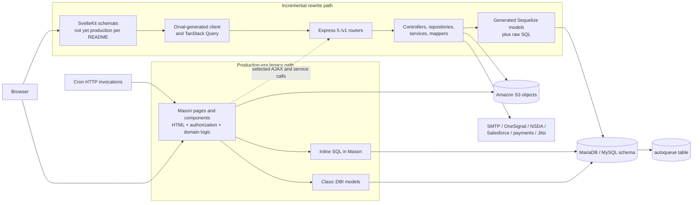
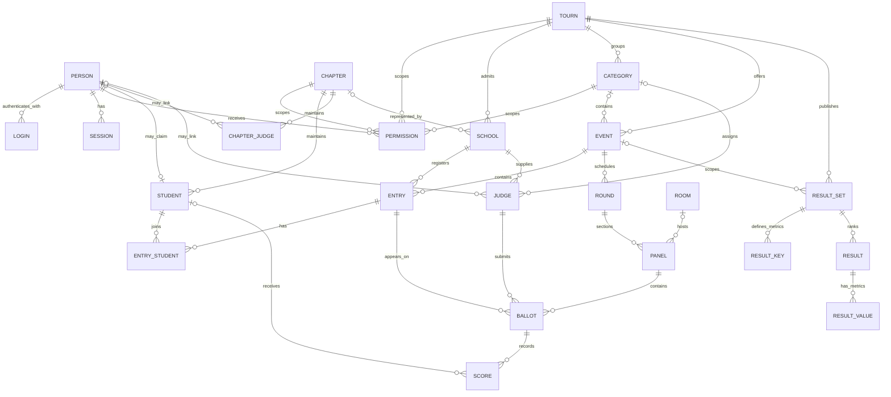
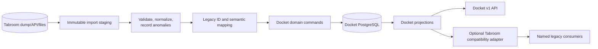
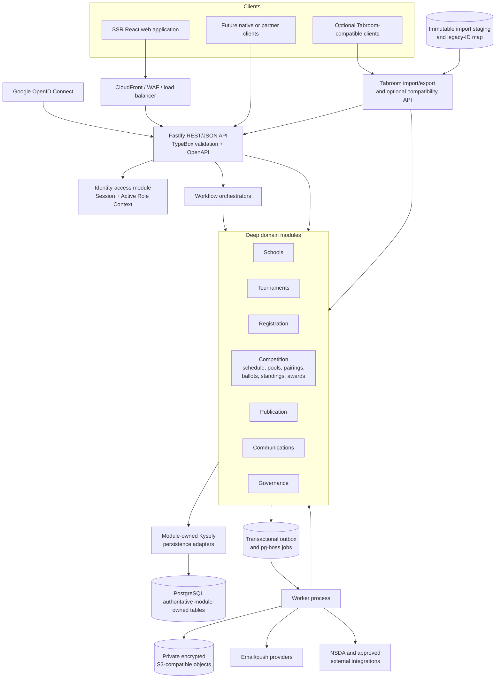

# Tabroom architecture investigation

**Research date:** 2026-09-12

**Purpose:** competitive architecture research for Docket; nonnormative and not implementation authorization
**Primary revisions inspected:** legacy `tabroom` at `b3a71a065f36cab222e55521b8827a1ed829bca9`; `Tabroomv4` at `0fe17ddafca242ddd9c5e2688b93dc9e443696ee`

> **Supersession note (2026-09-17):** References below to direct Google OIDC and an AWS-hosted web edge describe the architecture accepted when this research was written. Revised ADR 0029 assigns authentication and sessions to Clerk, and revised ADR 0034 hosts the web application on Vercel while retaining durable backend services on AWS. The research findings remain nonnormative historical evidence.

## Executive answer

Yes. Docket can reproduce Tabroom's tournament-management capabilities and the useful semantics of its data model while using a redesigned backend and a completely new frontend.

The safest path is **Restructure with a bounded Emulation layer**:

- Keep Tabroom's domain lessons: a persistent organization distinct from its tournament-local delegation, Entries composed of Competitors, tournament-local Judges, Event/Round/Panel/Ballot/Score progression, configurable tiebreak protocols, explicit publication records, and resource-scoped authority.
- Do not make Tabroom's 108-table MariaDB schema, EAV setting tables, integer identities, sparse foreign keys, Perl/Mason pages, or generated Sequelize models Docket's internal architecture.
- Put any required Tabroom compatibility at the edge: import/export translators, legacy-ID mappings, and—only if a real consumer requires it—a versioned compatibility API. Do not permit a compatibility client to query or mutate Docket tables directly.
- Continue Docket's accepted architecture: PostgreSQL as the authority; module-owned schemas and forward migrations; a modular TypeScript monolith; explicit domain services; Kysely persistence adapters; versioned REST/JSON and OpenAPI-generated clients; Google OIDC for authentication with Docket-owned authorization; transactional outbox and PostgreSQL-backed jobs; private object storage; and an independent server-rendered React application.

That recommendation is based on the code, not merely on Tabroom's README. The linked repository identifies itself as the feature-frozen, production-era Perl/Mason implementation. It also says the Express API is increasingly used by legacy pages and that the Svelte client is not yet in production.[1] The current `Tabroomv4` repository contains the Express and Svelte work, but both still model and access the same legacy MariaDB shape rather than introducing a clean replacement database.[8][9]

## Scope, evidence, and confidence

### Repositories inspected

| Repository | Revision | Role established by source | Confidence |
| --- | --- | --- | --- |
| `speechanddebate/tabroom` | `b3a71a0...` | Current working legacy Perl/Mason code, feature-frozen and being phased out | High |
| `speechanddebate/Tabroomv4` | `0fe17dd...` | Monorepo for the Express `indexcards` backend, SvelteKit `schemats` frontend, and shared types | High |
| `speechanddebate/indexcards` | `794bfbc...` | Archived pointer to the monorepo | High |
| `speechanddebate/schemats` | `686a572...` | Archived pointer to the monorepo | High |
| `speechanddebate/mason-docker` | `1e7b36c...` | Dependency image for Apache/mod_perl/Mason deployment | High |

The database analysis uses `doc/sql/current-schema.sql`, the legacy Class::DBI models, the generated Sequelize models and associations, and live query code. The SQL file is a schema dump, not a reliable ordered migration history. Other SQL snapshots in the repository differ, and the application manually declares relationships absent from generated metadata. Therefore this report treats the current schema dump plus actual access code as stronger evidence than older initialization files.

### Meaning of labels

- **Observed:** directly supported by repository code or configuration.
- **Inferred:** a conclusion from multiple observed facts; production runtime state was not independently inspected.
- **Recommended:** a Docket design judgment, not a statement about Tabroom.

## 1. Tabroom's current architecture

Tabroom is best understood as a **hybrid migration architecture around one legacy relational database**.

1. The production-era path is Apache/mod_perl with Mason 1. URL-addressed `.mhtml` and `.mas` components render HTML, perform authorization, execute domain logic, and access MariaDB through both Class::DBI objects and inline SQL.[1][2][5]
2. `indexcards` is an Express 5 API. It authenticates every request, mounts versioned routers under `/v1`, uses controllers/repositories/services in newer areas, and accesses the same MariaDB database through Sequelize plus raw SQL.[8][9][10]
3. Some legacy Mason pages call `indexcards` with jQuery/AJAX—for example inbox, status, ballot autosave, and service-to-service notification operations. The migration is therefore incremental rather than a clean cutover.[1][6]
4. `schemats` is a Svelte 5/SvelteKit frontend. It uses an OpenAPI-generated Orval client and TanStack Query against `indexcards`, with server hooks forwarding the shared authentication cookie and CSRF token. The legacy README explicitly says this frontend is not yet in production.[1][15]
5. MariaDB stores transactional records, settings, sessions, scheduled work, file metadata, and publication records. S3 stores uploaded/generated file bodies and database backups. SMTP, OneSignal, NSDA and other services are external integrations.[3][7][9]

### Observed request and data flow

This differs materially from a conventional `frontend → API → service → repository → database` architecture. The newer path approximates that layering, but the legacy path collapses presentation, application, and persistence concerns into Mason components. Even in `indexcards`, controllers and services sometimes execute raw SQL directly, so repository boundaries are not consistently enforced.

## 2. Storage architecture

### Database technology and schema characteristics

**Observed:**

- The legacy DB connector subclasses Class::DBI and uses a `dbi:mysql` connection.[2]
- The current schema is MySQL/MariaDB-flavored SQL using InnoDB, `AUTO_INCREMENT` integer primary keys, MySQL enums, `tinyint` booleans, `datetime`/`timestamp`, and mostly `utf8mb3`.[3]
- `indexcards` config defaults to port 3306 and Sequelize's `mariadb` dialect; it can name a replica in configuration, although the inspected connection constructor uses the primary host.[9][10]
- The schema dump defines **108 tables but only 35 declared foreign-key clauses**. Many semantically obvious relationships are indexed but not constrained. The Class::DBI models and manual Sequelize associations carry additional relationship knowledge.[3][4][10]
- Two database triggers derive `entry.active` before insert and update from `dropped`, `waitlist`, and `unconfirmed`. This is the limited but important domain logic found in the current schema dump.[3]
- No ordered application migration framework was found in the inspected current repositories. There are schema dumps, initialization files, and individual SQL maintenance/patch files. This is not enough to infer a reproducible production migration chain.

**Inference:** the database is simultaneously the shared integration boundary, the legacy compatibility contract, and a source of hidden semantics. Copying only table definitions would not copy all behavior because models, settings, queries, autohandlers, cron components, and frontend expectations also encode rules.

### Major entities and relationships

Tabroom names a persistent school or club a **Chapter** and a tournament-specific participating delegation a **School**. That distinction is one of its most useful modeling choices.

The diagram shows the intended domain relationships, not the set of enforced SQL foreign keys. In particular, `entry`, `event`, `judge`, `round`, `panel`, `ballot`, `score`, and `result` rely heavily on indexes and application-model associations rather than complete database referential constraints.[3][4]

| Area | Tables/entities | Representation and important semantics |
| --- | --- | --- |
| Identity | `person`, `login`, `session`, `person_setting` | `person` is the account/profile; one person can have login rows and database-backed sessions. Sessions carry a token (`userkey`), person, impersonator (`su`), UI/default context, client and geolocation data. |
| Authority | `permission`, plus `person.site_admin` | A permission has a role-like `tag`, a `person`, and nullable scope columns such as tournament, chapter, circuit, district, region, category, and (in the model) event. The row is effectively a polymorphic scoped grant. |
| Durable organizations | `chapter`, `chapter_setting`, `chapter_circuit`, `chapter_judge` | A Chapter is a persistent school/club identity, with external IDs and roster/Judge records. It is not itself a tournament registration. |
| Tournament delegations | `school`, `school_setting` | A School is a tournament-local delegation linked to one `tourn` and optionally one `chapter`, with local name/code/region/district. It owns tournament Entries and supplied Judges. |
| Competitors | `student`, `student_setting`, `entry_student` | A Student is a persistent competitor profile linked to a Chapter and optionally a Person account. `entry_student` is the many-to-many roster join between Student and Entry. |
| Tournament definition | `tourn`, `tourn_setting`, `category`, `event`, `timeslot`, `site`, `room`, `pattern`, `topic` | Tournament carries identity/dates/location. Category groups events and Judge pools. Event identifies activity type and level. Timeslots/sites/rooms support scheduling. Much behavior is in setting rows. |
| Registration and finance | `entry`, `entry_setting`, `judge`, `judge_setting`, `fine`, `invoice`, `tourn_fee`, concession/housing tables | Entry belongs to tournament, School, and Event. Judge is tournament-local and can link to School, category, persistent Chapter Judge, and Person. Registration state is represented by several flags; triggers derive `active`. |
| Judge allocation | `jpool`, `jpool_judge`, `jpool_round`, `judge_hire`, `rating*`, `strike`, `conflict` | Pools connect Judges to categories/rounds. Ratings, strikes, and conflicts influence eligibility or preference. Exact pairing behavior is mostly code and settings rather than declarative schema. |
| Competition | `round`, `round_setting`, `panel`, `panel_setting`, `ballot`, `score`, `student_ballot`, `student_vote` | Round belongs to Event and may reference timeslot/site/protocol. Panel is a section/pairing within a Round and carries room, flight, bye, bracket, and publication fields. Ballot joins one Panel, Entry, and Judge; Score stores tagged numeric/text values, often per Student/speech/position. |
| Calculation protocols | `protocol`, `protocol_setting`, `tiebreak` | Protocol and ordered tiebreak rows parameterize standings/results behavior. Additional behavior remains in Perl/JavaScript calculation code. |
| Published results | `result_set`, `result_key`, `result`, `result_value`, sweep/qualifier tables | A Result Set is a generated/published snapshot-like grouping for a tournament/event. Keys describe metrics; Results identify ranked entities or round/panel records; Values hold metric values. This is distinct from source Ballots and Scores. |
| Files | `file` plus S3 object keys | The relational row stores metadata and links to tournament/school/entry/event/etc.; file bytes are uploaded to S3 paths assembled by application code.[7] |
| Communications | `email`, `follower`, external mail/push providers | Email content, metadata, recipients, and send state are persisted; external delivery is done by mail/push integrations. |
| Operations/audit | `autoqueue`, `change_log`, `campus_log`, `stats`, `tabroom_setting` | `autoqueue` is a database-backed schedule/job table. `change_log` is a broad mutable relational log shape with many nullable resource references; it should not be assumed to provide Docket-grade immutable audit guarantees. |

### The setting system is part of the effective schema

The apparent relational schema is not the whole data model. There is a global `setting` definition table and many owner-specific tables such as `tourn_setting`, `event_setting`, `round_setting`, `panel_setting`, `entry_setting`, `category_setting`, `judge_setting`, `school_setting`, and `person_setting`. Each stores a tag and one of short, text/JSON, or date values. `indexcards` has generic `summon` and `setting` helpers that discover setting associations, fold rows into a `settings` object, parse tagged JSON/dates/text, and create/update/delete settings.[10]

This EAV-like design offers extensibility without frequent DDL, but it weakens type safety, discoverability, referential integrity, query planning, and migration confidence. A Tabroom-compatible import must preserve unknown tags even if Docket maps known tags into typed columns or typed configuration documents.

### Caching, file storage, queues, and secondary stores

| Concern | What the source shows | What cannot be concluded |
| --- | --- | --- |
| File/object storage | S3 bucket and URL configuration, `s3cmd` in legacy upload/delete/copy paths, AWS SDK in `indexcards`, and S3 database-backup scripts.[7][9] | Repository code does not prove current bucket policy, encryption, retention, or production IAM posture. |
| Background work | `autoqueue` rows contain job tag, Round/Event, activation time, message, creator, and timestamps. Cron invokes `/api/auto_queue.mhtml` every minute; the handler implements database locks, selects due rows, runs tag-specific behavior, and deletes jobs.[6] | There is no basis to claim exactly-once delivery, durable retry semantics, isolation, or modern worker leasing. |
| Caching | Schemats uses TanStack Query with default 15-second staleness and 150-second refetch values. No explicit Redis/Memcached or message broker dependency was identified in the inspected application manifests/configuration.[9][15] | Absence from source does not prove production infrastructure has no proxy/CDN cache. |
| Sessions | Session tokens and context are database rows shared by legacy and new stacks; `indexcards` uses a shared secret/cookie configuration to coexist with classic Tabroom.[3][9][11] | Production cookie rotation, cleanup policy, and all operational controls cannot be verified from repository code alone. |
| Backups | Repository scripts dump/compress databases and copy backups to S3.[7] | Successful restore testing, actual schedule, retention, and recovery objectives are not established by the scripts alone. |

## 3. How Tabroom reads and modifies data

### Legacy Perl/Mason path

**Observed architecture:**

- `Tab::DBI` is a Class::DBI base class. Individual model modules declare `table`, `columns`, `has_a`, `has_many`, many-to-many traversals, and named SQL queries.[2][4]
- Mason request components load identity/session data and tournament permissions in autohandlers. Area-specific autohandlers for `/user`, `/tabbing`, and `/setup` redirect or abort when identity, tournament context, or expected role tags are absent.[5]
- Data access is not confined to models. In the inspected checkout, 881 of 2,462 Mason `.mhtml`/`.mas` files matched direct database-handle, prepared-statement, or SQL patterns. This count is an investigation aid rather than a formal static-analysis result, but it establishes that raw SQL is pervasive.
- Domain logic is spread across model methods, `funclib` components, page handlers, SQL, JavaScript embedded in pages, settings, and two database triggers. The frontend/backend boundary is therefore porous.
- `web/api/` is a mixed set of cron handlers, data exports/imports, CSV endpoints, maintenance jobs, payment callbacks, point calculations, and query helpers. It is not a uniform public REST contract.[6]

### Express `indexcards` path

`indexcards` is more structured but remains a compatibility rewrite over the legacy database:

- Express middleware adds request IDs, configuration, and the database object; parses body/cookies; authenticates every request; applies a production rate limiter; applies CSRF handling; and mounts `/v1` routers.[9]
- Sequelize models are generated with `sequelize-auto`. The application then adds missing relationships manually. Generic setting helpers adapt EAV rows into JavaScript objects.[10]
- Newer code has repositories and mappers for major records and a smaller service layer for result and round logic. However, raw `sequelize.query` calls occur in approximately 90 JavaScript/TypeScript files across controllers, helpers, services, scheduled work, and repositories. Controllers can also receive `req.db` directly. The intended layering is therefore partial, not enforced.
- The OpenAPI builder scans router metadata, and the generated document is served at `/v1`; Scalar documentation is exposed at `/v1/reference`.[12]
- Configuration includes MariaDB, CORS, cookie/session, CSRF, rate limits, S3, SMTP, OneSignal, NSDA, Salesforce/NAUDL, Jitsi, geolocation, and infrastructure/autoscaling concerns in the same API process configuration.[9]

### Authentication and authorization

**Legacy:** the root autohandler calls a Mason authentication component, loads a Person and Session, resolves selected tournament context, and obtains permissions. Area autohandlers check `site_admin` and role tags such as owner, tabber, limited, and checker.[5]

**Indexcards authentication:**

- Cookie authentication reads the configured `TabroomToken` (or a configured session header), retrieves a database Session by `userkey`, and creates a CSRF token for cookie-authenticated requests.[9][11]
- Basic authentication treats the username plus a `person_setting` named `api_key` as credentials.[11]
- Bearer authentication also resolves the presented token as a database session key; it is not, in the inspected middleware, an independently verifiable OAuth access token.[11]
- Login/logout/register routes issue or clear the cookie. Superuser start/end routes and the `session.su` field support impersonation.[3][12]

**Indexcards authorization:**

- `requireLogin` and `requireSiteAdmin` protect broad route groups. Resource middleware loads tournament/chapter/external authorization context from permission rows.[12][13]
- The newer authorization module maps permission tags to roles and capabilities, follows tournament → category/event/timeslot and event → round hierarchies, and checks inherited scopes.[13]
- Public tournament routes use public/published checks; user routes require login; admin routes require site admin. Some in-progress tab/admin/external/coach routes are hidden behind `HIDE_DEV_ENDPOINTS` by default.[9][12]

**Inference and risk:** Tabroom has real scoped authorization concepts, but identity, session, selected UI context, impersonation, and permissions are tightly interwoven. Docket should preserve scoped authority as a concept, not port the session/permission implementation. In particular, Docket's accepted rule that external identity establishes identity but not application authority is safer than treating shared cookies, email/profile settings, or client-selected tournament context as sufficient authorization.

### API and route inventory

The generated OpenAPI document at the inspected revision contains **64 paths and 66 operations**: 5 auth, 8 synthesized page-data, 27 public/read-oriented REST, and 26 authenticated user operations. The route tree itself is larger—52 router files—because hidden development and legacy-compatible routes are not all represented as stable production API operations.[12]

| Surface | Representative operations | Architectural role |
| --- | --- | --- |
| `/v1/auth` | login, logout, register, superuser start/end | Session lifecycle and impersonation |
| `/v1/rest` | tournament search/detail, events, rounds, schematic/pairings, schedule, result sets, records, circuits, paradigms, quizzes | Mostly public or published read models |
| `/v1/pages` | invitation/current/upcoming tournament views, round protocol/tiebreak payloads | Page-oriented aggregate payloads for the new UI |
| `/v1/user` | current session, Chapters, tournament summary/ballots/fines, inbox, Judge/Student claims, paradigm update | Authenticated participant operations |
| Hidden `/v1/tab`, `/v1/admin`, `/v1/ext`, `/v1/coach` | tabulation, operations, integrations, coach functions | In-progress or compatibility surfaces behind a feature flag |
| Legacy `web/api` | cron queue, CSV, exports/imports, payment confirmation, point awards, maintenance | Mixed operational endpoints rather than a coherent public API |

The OpenAPI surface is useful evidence of an emerging frontend boundary, but it is not a complete stable contract. The generated specification itself marks a number of handlers “undocumented,” and some result/bracket controller code contains incomplete behavior/debug output.[12][14]

### Frontend/backend integration

The production-era UI is not independently replaceable without first creating an API or application-service boundary, because Mason pages directly participate in authentication, permission checks, queries, writes, calculations, and rendering.

The `schemats` direction proves an independent frontend is feasible:

- SvelteKit loads a shared auth cookie, calls the API's user-session operation, and forwards cookies for the API's sister subdomain.
- Mutating server-side fetches receive a CSRF header derived from the CSRF cookie.
- Orval generates Svelte Query clients and schemas from the API's OpenAPI document; requests include credentials.
- TanStack Query provides client-side request caching/refetch behavior.[15]

However, adopting `schemats` source is unnecessary for Docket. The reusable idea is the generated-client boundary, not the Svelte implementation or the legacy shared-cookie mechanics.

## 4. Can the storage architecture be cloned?

### What could be cloned or directly reused

Technically, a team could recreate a MariaDB instance from the schema dump, run the legacy application against it with the expected configuration, use the Class::DBI models, deploy the Apache/mod_perl/Mason dependency image, and place `indexcards` beside it. The following are concrete reusable assets:

- schema dump and ad hoc SQL maintenance files;
- Perl Class::DBI model definitions and named queries;
- Mason workflows and calculation code;
- Express routers/controllers/repositories/services;
- generated Sequelize model pipeline;
- OpenAPI generation and API operation definitions;
- SvelteKit client and generated-client configuration;
- Docker/deployment examples and operational scripts.

### Why cloning is a poor Docket foundation

1. **The database is not a self-contained architecture.** Many relationships are unconstrained, behavior lives in settings and code, and only two narrow rules are enforced by triggers. A schema-only clone would be behaviorally incomplete.
2. **The legacy application is tightly coupled.** Mason pages combine view, access control, application behavior, and SQL. Replacing the UI while retaining this backend would require extracting an API around much of the application anyway.
3. **The rewrite still inherits the old schema.** Generated Sequelize models, manual associations, generic setting adapters, and extensive raw SQL preserve compatibility but also preserve schema debt.
4. **Operational assumptions are bespoke.** Cron calls HTTP Mason handlers; the database doubles as a job queue and session store; file paths are constructed around known S3 layouts; and configuration spans many integrations.
5. **Security modernization becomes constrained by compatibility.** Shared database session tokens, API keys in settings, broad site-admin bypass, and superuser impersonation are not appropriate defaults for Docket.
6. **The new API is incomplete as a full replacement.** Stable documented operations do not yet cover the entire legacy product, and significant route groups are hidden as in-progress.
7. **Licensing is unusually consequential.** Both repositories declare RPL-1.5.[1][8] The license defines deployment broadly, including organizational use outside research/personal use, and treats schemas, interface definitions, scripts, and other required components as potentially covered extensions; deployed extensions must be made available under the license.[16] Direct reuse therefore needs qualified legal review and a willingness to satisfy reciprocal source/notice obligations. This report is not legal advice.

### Implementation clone versus functional reproduction

These must not be conflated:

- **Implementation clone:** copy or modify Tabroom source, schema, interface definitions, or substantial expressive implementation. This maximizes compatibility but inherits architecture and licensing obligations.
- **Functional reproduction:** independently specify tournament concepts and observable behavior, then implement them using Docket's own names, contracts, schemas, and algorithms. General functionality and domain facts are different from copying protected expression, but exact schema/API copying and code-derived implementation still require legal review.

The safest engineering and licensing posture is a clean, documented Docket model informed by observable requirements and independently written compatibility mappings. If exact wire compatibility or copied schema definitions become a business requirement, obtain counsel before implementation.

## 5. Can the architecture be emulated?

Yes. Emulation is realistic and considerably safer than making Tabroom's database Docket's source of truth.

### Semantics worth emulating

- stable organization versus tournament-local delegation (`chapter` versus `school`);
- persistent Competitor and Judge identities with tournament-specific participation records;
- Tournament → Event → Round → Panel/Pairing progression;
- Entry membership as an explicit association, not embedded names;
- Judge pools, availability, ratings, strikes, conflicts, and assignments;
- Ballot as the Judge/Entry/Panel record and Score as rubric/metric facts;
- configurable standings and tiebreak protocols;
- source Ballots/Scores distinct from generated/published Results;
- resource-scoped roles and public-versus-private projections;
- file metadata distinct from object bodies;
- scheduled publication, messaging, and other asynchronous work.

### Semantics that require explicit compatibility work

| Compatibility subject | Required work |
| --- | --- |
| IDs | Maintain a mapping such as `(source_system, entity_type, legacy_integer_id) → Docket UUID`; never make legacy IDs Docket primary keys. |
| Chapter/School | Map persistent organizations separately from tournament delegations; preserve tournament-local aliases/codes. |
| Settings | Define a catalog of known tags and typed translations; retain unknown source tags in a quarantined import payload for round-trip or later analysis. |
| Permissions | Translate each legacy tag/scope to a Docket capability bundle; reject ambiguous, multi-scope, or invalid rows for review. |
| Registration state | Translate combinations of active/dropped/waitlist/unconfirmed and trigger-derived behavior into explicit Docket states and history. |
| Pairings/ballots | Preserve Round/Panel/Entry/Judge/side/flight/room ordering and uniqueness semantics; validate orphaned legacy references. |
| Scores/results | Recompute from imported source evidence where possible; compare with legacy Result Sets rather than trusting materialized results blindly. |
| Time | Interpret legacy datetimes using the tournament's IANA timezone, record conversion provenance, and store normalized instants plus zone. |
| Files | Import metadata and objects separately; virus-scan, authorize, hash, and re-key objects into Docket-owned private prefixes. |
| Publication | Treat imported public outputs as immutable source snapshots with provenance; do not silently turn them into editable authoritative state. |
| API | Reproduce only documented operations required by named consumers. Use contract fixtures and consumer tests, not table equivalence, as the compatibility test. |

### Compatibility-layer shape

The adapter should be an anti-corruption layer: Tabroom terminology and irregularities stop there. Docket modules should never import legacy database types or expose Kysely tables to it.

## 6. Can the backend be restructured?

Yes, and the repository evidence strongly favors it.

### Preserve conceptually

- relational authority for tournament state;
- explicit organization/delegation/participant distinctions;
- robust tournament-scoped configuration, but with typed schemas;
- separated source evidence and publication output;
- resource-scoped authorization;
- domain-specific calculations for pairings, ballots, standings, advancement, and awards;
- asynchronous publication, notification, and export work;
- import/export and external-integration capabilities.

### Redesign

| Tabroom characteristic | Docket redesign |
| --- | --- |
| Shared legacy schema is the integration contract | Domain module interfaces and versioned API contracts are the integration contract. |
| Sparse foreign keys and implicit associations | PostgreSQL constraints, checks, exclusion/unique constraints, and explicit state transitions enforce invariants. |
| Broad EAV setting tables | Typed configuration records per aggregate; a constrained extension document only where real variability requires it. |
| Mason pages contain queries and writes | Transport adapters call domain commands/queries; presentation never touches persistence. |
| Sequelize models generated from production schema | Module-owned TypeScript/runtime schemas and forward migrations are authoritative; Kysely adapters implement persistence. |
| Controllers/services/repositories can all issue raw SQL | Only an owning module's persistence adapter queries its tables; application and web layers receive domain projections. |
| Database session token doubles as bearer token | OIDC-backed Docket Session, secure rotation/revocation, explicit CSRF posture, and separate machine credentials. |
| Permission tags plus nullable scope columns | Explicit role/capability grants with one validated scope and server-derived Active Role Context. |
| Superuser impersonation | Audited support tooling without identity substitution; privileged actions remain attributable to the actual actor. |
| `autoqueue` plus cron/HTTP handler | Transactional outbox, leased at-least-once jobs, idempotency keys, retries, dead-letter/escalation state, and a separate worker process. |
| Mutable/generated result tables mixed with source state | Immutable publication versions and current-public pointers built from versioned source projections. |
| S3 paths assembled by page code | Private object adapter, opaque keys, checksums, malware/content validation, authorization before short-lived access. |

### Where significant logic should live

- **Database:** structural integrity, uniqueness, foreign keys, atomic state constraints, transaction boundaries, durable outbox/job state—not pairing algorithms or permission policy hidden in triggers.
- **Domain/application modules:** all authoritative tournament rules, state transitions, authorization decisions, calculations, publication gates, and workflow orchestration.
- **API layer:** authentication evidence handling, input/output validation, context resolution, command/query dispatch, stable error mapping, and audience-safe serialization.
- **Frontend:** interaction and presentation state only; it may preview calculations but cannot establish authority or authoritative results.

## 7. Can the frontend be recreated independently?

Yes. Tabroomv4's own SvelteKit/Orval work demonstrates the architectural feasibility, but Docket need not use its UI code.[15]

The required boundary is a versioned, documented API that exposes domain commands and audience-specific projections rather than generic CRUD or database-shaped payloads. At minimum it should cover:

- identity/session and available role contexts;
- Tournament discovery, detail, lifecycle, staff, settings, and publication;
- School/organization roster and tournament delegation;
- registration, Entries, Competitors, Judges, obligations, fees, and status;
- schedule, rooms, Judge pools, conflicts/strikes, Pairings, and assignments;
- ballot retrieval, autosave/submission, audit/correction, and version conflicts;
- standings, advancement, awards, results, and publication history;
- files, notifications/inbox, exports/imports, and integration status;
- stable pagination/filtering, idempotency, optimistic concurrency, and machine-readable errors.

OpenAPI should generate the frontend client and runtime-compatible types. Every response should already be filtered for the authenticated actor and active scope. A new React, Svelte, native, or other client could then be substituted without changing database or domain code.

## 8. Clone versus Emulate versus Restructure

Ratings are relative for Docket: 1 is favorable/easy/low risk; 5 is unfavorable/hard/high risk. For maintainability, scalability, flexibility, and UI independence, 5 means strongest.

| Criterion | A. Clone | B. Emulate | C. Restructure |
| --- | ---: | ---: | ---: |
| Initial development difficulty | 2 | 4 | 5 |
| Full-product completion difficulty | 4 | 4 | 4 |
| Maintainability | 1 | 3 | 5 |
| Scalability/isolation | 2 | 3 | 5 |
| Migration complexity from Tabroom data | 2 | 4 | 5 |
| Exact data compatibility | 5 | 4 | 2 by default; 4 through adapter |
| Exact API compatibility | 3 | 4 if deliberately built | 2 by default; 4 through adapter |
| Security posture | 1 | 3 | 5 |
| Long-term flexibility | 1 | 4 | 5 |
| Completely new UI | 2 without extraction; 4 after API wrapper | 5 | 5 |
| Licensing exposure from copied implementation | 5 | 2–4 depending on exactness | 1–2 with clean implementation |

### A. Clone

**Benefits:** shortest route to operating known workflows; easiest import of a raw Tabroom database; highest initial table compatibility; existing calculation code and pages are available.

**Costs/risks:** RPL obligations; Perl/Mason and bespoke deployment expertise; incomplete constraints/migrations; EAV complexity; tightly coupled UI; mixed data-access styles; inherited authentication and impersonation model; difficult incremental modernization; and eventual need to finish the same extraction that Tabroomv4 is undertaking.

**Verdict:** suitable only for a short-lived internal research environment or a consciously RPL-compliant fork. Not recommended as Docket's product architecture.

### B. Emulate

**Benefits:** retains compatibility where valuable; allows a cleaner implementation and independent UI; can support staged data migration; avoids dependency on a live Tabroom database.

**Costs/risks:** hidden semantics in settings and page code; exact algorithm parity is expensive; malformed/orphaned historical rows require policy; API compatibility can become an endless target; copying exact schema/interface artifacts may still raise licensing questions.

**Verdict:** appropriate as an edge capability with an explicit compatibility matrix, not as the organizing principle for all Docket internals.

### C. Restructure

**Benefits:** strongest integrity, security, testability, maintainability, observability, and UI independence; typed domain model; explicit module ownership; scalable API/worker processes; and freedom to improve workflows instead of preserving accidental schema behavior.

**Costs/risks:** greatest up-front modeling and migration work; risk of missing obscure Tabroom behavior; requires golden examples and dual-result comparison for calculations; selected integrations may require adapters.

**Verdict:** recommended. Combine it with targeted Emulation for import/export and any proven external consumers.

## 9. Recommended Docket architecture

This recommendation confirms rather than changes Docket's accepted ADRs 0031–0036 and repository/module map.[17][18]

### Component responsibilities

| Layer | Recommended responsibility |
| --- | --- |
| PostgreSQL | Authoritative transactional state, module-owned schemas/migrations, integrity constraints, versions, immutable privileged audit events, outbox, and first-release durable jobs. |
| Data access | Kysely adapters internal to each owning module. No application, UI, foreign module, or compatibility adapter receives direct table access. |
| Domain/application | Cohesive commands, queries, policies, calculations, and state machines. Cross-module workflows use explicit orchestration, durable events, and compensation. |
| API | Fastify transport, TypeBox validation, OpenAPI contract, authentication evidence, context resolution, authorization invocation, idempotency/concurrency controls, privacy-safe errors and projections. |
| Authentication/authorization | Google OIDC authenticates identity; Docket Sessions and Docket-owned grants establish authority. Scope and active role are server-derived and audited. |
| Frontend | SSR React Router UI using only generated OpenAPI clients; role-scoped workflows, accessibility, responsive behavior, and presentation state. No domain or authorization authority. |
| Async work | Transactional outbox and pg-boss behind an internal queue interface; idempotent workers for publication, exports, email, integrations, and file processing. |
| Objects | Private encrypted S3, opaque object keys, checksums, version/retention metadata, and short-lived authorized access. |
| Compatibility | Separate import/export package and optional external API adapter. Legacy identifiers and payloads do not leak into core module contracts. |

### Recommended logical data model

Use Docket's accepted domain names rather than Tabroom table names:

- `Account`, `IdentityLink`, `Session`, `RoleContext`, `AccessGrant/Offer`;
- `School`, `SchoolMembership`, `CompetitorProfile`, `JudgeProfile`;
- `Tournament`, `TournamentStaffAssignment`, `Event`, `ScheduleSlot`, `Site`, `Room`;
- `Registration`, `Delegation`, `Entry`, `EntryCompetitor`, `JudgeCommitment`;
- `JudgePool`, `Conflict`, `Strike`, `Pairing`, `PairingPosition`, `JudgeAssignment`;
- `Ballot`, `BallotRevision`, `Rubric`, `Score`, `Decision`, `AuditOutcome`;
- `StandingsPlan`, `StandingSnapshot`, `AdvancementPlan`, `Bracket`, `AwardPlan`;
- `PublicationVersion`, `CorrectionNotice`, `CurrentPublicationPointer`;
- `NoticeIntent`, `DeliveryAttempt`, `InboxItem`;
- `FileObject`, `ExportArtifact`, `ImportBatch`, `LegacyIdentityMap`;
- `DomainEvent`, `OutboxRecord`, `Job`, `PrivilegedAuditEvent`.

This is semantically compatible with the useful Tabroom relationships while making lifecycle, versioning, audience, and ownership explicit.

## 10. Phased migration and development strategy

No implementation is authorized by this research. If the owner later authorizes a build, use the existing Docket work graph and Sol-only orchestration; this sequence is architectural migration guidance, not a replacement build queue.

### Phase 0 — freeze the compatibility target

- Record the exact Tabroom source revision, schema dump, and sample/export format under permitted provenance rules.
- Inventory named consumers and integrations. Classify each required compatibility surface as data import, data export, behavior, or API.
- Obtain license counsel before copying any source/schema/interface artifact or deploying a derivative.
- Define “compatible” per capability; do not promise universal table or endpoint parity.

**Exit:** a signed compatibility matrix and licensing decision, with no ambiguous “clone Tabroom” requirement.

### Phase 1 — behavioral specification and canonical model

- Convert observed workflows into Docket-owned domain rules and examples.
- Map Chapter/School, Person/Student/Judge, Entry, Round/Panel/Ballot/Score, protocol/tiebreak, and publication concepts.
- Catalogue known setting tags by owner and business meaning; classify each as typed Docket configuration, obsolete, integration-only, or unknown-preserved.
- Define invariants, state transitions, authorization cells, privacy audiences, and correction/history behavior independently of Tabroom's tables.

**Exit:** Docket model and contracts can describe the target capabilities without referring to a Tabroom row during normal operation.

### Phase 2 — platform and identity boundary

- Establish the accepted modular monolith, PostgreSQL, module ownership, migrations, API/worker separation, OpenAPI generation, OIDC Session, and Docket authorization boundary.
- Establish outbox/jobs, audit, object storage, error/idempotency/concurrency contracts, and observable operations.
- Keep compatibility code outside domain modules.

**Exit:** one secure vertical path works entirely on Docket-owned state after build authorization.

### Phase 3 — immutable import pipeline

- Ingest a sanitized Tabroom dump/export into immutable staging, not directly into authoritative tables.
- Validate referential anomalies, duplicate identities, invalid state combinations, timezone ambiguity, unknown settings, missing files, and unsupported permissions.
- Create deterministic legacy-ID mappings and provenance for every transformed record.
- Invoke ordinary Docket commands to create authoritative state so imports cannot bypass invariants or audit.

**Exit:** imports are repeatable, explain anomalies, and produce no direct table writes outside owning modules.

### Phase 4 — capability slices and comparison

Implement only when separately authorized, in dependency order:

1. identity, Schools, memberships, and tournament authority;
2. Tournament/Event/Schedule/Site/Room configuration;
3. registration, Entries, Competitors, Judges, obligations, and finance essentials;
4. Judge pools, conflicts/strikes, Pairings, and assignments;
5. Ballots, Scores, audit/correction, and Judge workflows;
6. standings/tiebreaks, advancement, brackets, awards, and Final Results;
7. publication, communications, files/exports, and integrations.

For calculations, run fixed legacy examples through both systems, record intentional differences, and make Docket's result explainable. Do not use production dual writes as the first validation mechanism.

**Exit:** each accepted Docket capability has observable parity or an approved redesign decision.

### Phase 5 — optional compatibility API and new UI

- Build the Docket UI against generated Docket OpenAPI clients from the beginning.
- Add a Tabroom-shaped API only for named consumers that cannot migrate; translate from Docket projections and commands.
- Version compatibility endpoints separately, meter/deprecate them, and prevent them from defining the core domain.

**Exit:** Docket's frontend can be replaced independently, and compatibility clients are isolated behind a measurable adapter.

### Phase 6 — migration rehearsal and cutover

- Rehearse full import, file transfer, identity matching, publication validation, and rollback from production-like snapshots.
- Establish a read-only/freeze window or an explicit change-capture strategy; never rely on an uncoordinated one-time dump.
- Reconcile counts and domain invariants, not merely row counts. Sample high-risk pairings, Ballots, results, permissions, and public artifacts.
- Preserve source provenance and a read-only legacy archive for the agreed retention period.

**Exit:** documented recovery/cutback is possible, and stakeholders accept the reconciled Docket state.

### Phase 7 — retire compatibility debt deliberately

- Observe actual use of import/export and compatibility endpoints.
- Migrate remaining consumers to Docket contracts.
- Remove legacy tag mappings and API shapes only through versioned deprecation and retained historical provenance.

**Exit:** Tabroom knowledge remains as reference and migration history, not a permanent constraint on Docket's core.

## Principal risks and mitigations

| Risk | Why it matters | Mitigation |
| --- | --- | --- |
| Hidden behavior in EAV tags/page code | Schema parity will miss functional rules | Setting catalogue, workflow traces, golden examples, and explicit gap ledger |
| Orphaned or contradictory legacy records | Sparse foreign keys permit historical anomalies | Immutable staging, anomaly classes, human review queues, domain-command import |
| Calculation drift | Pairings/standings can be consequential | Versioned rules, deterministic fixtures, dual-result comparison, explainable outputs |
| Permission mistranslation | Can expose student/Judge/tournament data | Deny ambiguous grants, server-derived scopes, least privilege, reviewed mappings |
| Timezone conversion | Legacy local datetimes can move rounds/deadlines | Tournament-zone interpretation with provenance and ambiguity reports |
| License contamination | Direct reuse may impose reciprocal obligations | Clean implementation boundary, provenance, counsel, no copied artifacts by default |
| Compatibility becoming the core | Recreates legacy architecture under new names | Adapter ownership, no legacy types in modules, named consumers and sunset policy |
| Big-bang cutover | Tournament operations are time-sensitive | Capability slices, rehearsals, read-only windows/change capture, cutback plan |

## Determinations and unknowns

### Determined from source

- Production-era Tabroom is a feature-frozen Perl/Mason application with Class::DBI and extensive direct SQL.
- Its authoritative relational store is MariaDB/MySQL-shaped and contains 108 tables in the current dump.
- The schema has sparse declarative referential integrity, EAV-like settings, two Entry-state triggers, database sessions, materialized result records, and a database-backed scheduled-work table.
- Files and backups use S3; cron invokes database-queue processing through Mason endpoints.
- `indexcards` is Express/Sequelize plus raw SQL over the same schema and exposes a partial OpenAPI-described `/v1` surface.
- `schemats` is a SvelteKit client using generated API code; the legacy README says it is not yet in production.
- Both code lines declare RPL-1.5.

### Not determined from repositories alone

- Exact production topology, traffic split, database version, replica usage, CDN/cache configuration, and infrastructure controls.
- Whether every checked-in table, route, cron task, and integration is currently active in production.
- Complete semantics of every setting tag and every historical data anomaly.
- Operational backup restore success, RPO/RTO, live encryption/IAM policy, or incident practices.
- A definitive legal conclusion about a particular Docket design; counsel must assess the intended reuse and deployment.

## Final recommendation

Choose **C. Restructure**, with **B. Emulate** limited to import/export and proven compatibility consumers. Do not choose **A. Clone** for Docket's product foundation.

Tabroom's source is most valuable as a domain archaeology corpus: it reveals entities, workflows, edge cases, publication patterns, and integration needs. Its database is not a clean standalone contract, and its current rewrite demonstrates how difficult it is to modernize while preserving that database as the center. Docket should preserve the tournament concepts, re-express them as explicit typed domain contracts and PostgreSQL invariants, expose them through a stable OpenAPI boundary, and let a completely new frontend depend only on that boundary.

## Sources

[1] [Legacy README: status, production stack, Indexcards, Schemats, and license](https://github.com/speechanddebate/tabroom/blob/b3a71a065f36cab222e55521b8827a1ed829bca9/README.md)

[2] [Legacy `Tab::DBI` Class::DBI/MySQL connector](https://github.com/speechanddebate/tabroom/blob/b3a71a065f36cab222e55521b8827a1ed829bca9/web/lib/Tab/DBI.pm)

[3] [Legacy current MariaDB schema dump](https://github.com/speechanddebate/tabroom/blob/b3a71a065f36cab222e55521b8827a1ed829bca9/doc/sql/current-schema.sql)

[4] [Legacy domain models (`web/lib/Tab`)](https://github.com/speechanddebate/tabroom/tree/b3a71a065f36cab222e55521b8827a1ed829bca9/web/lib/Tab)

[5] [Legacy root request/auth/tournament autohandler](https://github.com/speechanddebate/tabroom/blob/b3a71a065f36cab222e55521b8827a1ed829bca9/web/autohandler) and [tabulation-area authorization](https://github.com/speechanddebate/tabroom/blob/b3a71a065f36cab222e55521b8827a1ed829bca9/web/tabbing/autohandler)

[6] [Legacy mixed API/cron components](https://github.com/speechanddebate/tabroom/tree/b3a71a065f36cab222e55521b8827a1ed829bca9/web/api), [`autoqueue` processor](https://github.com/speechanddebate/tabroom/blob/b3a71a065f36cab222e55521b8827a1ed829bca9/web/api/auto_queue.mhtml), and [cron configuration](https://github.com/speechanddebate/tabroom/blob/b3a71a065f36cab222e55521b8827a1ed829bca9/doc/conf/crontab)

[7] [Legacy S3 configuration](https://github.com/speechanddebate/tabroom/blob/b3a71a065f36cab222e55521b8827a1ed829bca9/doc/conf/General.pm), [representative file upload](https://github.com/speechanddebate/tabroom/blob/b3a71a065f36cab222e55521b8827a1ed829bca9/web/setup/web/posting_upload.mhtml), and [database backup scripts](https://github.com/speechanddebate/tabroom/tree/b3a71a065f36cab222e55521b8827a1ed829bca9/doc/scripts)

[8] [Tabroomv4 monorepo README](https://github.com/speechanddebate/Tabroomv4/blob/0fe17ddafca242ddd9c5e2688b93dc9e443696ee/README.md) and [workspace manifest](https://github.com/speechanddebate/Tabroomv4/blob/0fe17ddafca242ddd9c5e2688b93dc9e443696ee/package.json)

[9] [`indexcards` application middleware](https://github.com/speechanddebate/Tabroomv4/blob/0fe17ddafca242ddd9c5e2688b93dc9e443696ee/indexcards/app.js), [runtime configuration schema](https://github.com/speechanddebate/Tabroomv4/blob/0fe17ddafca242ddd9c5e2688b93dc9e443696ee/indexcards/api/config.ts), and [package manifest](https://github.com/speechanddebate/Tabroomv4/blob/0fe17ddafca242ddd9c5e2688b93dc9e443696ee/indexcards/package.json)

[10] [`indexcards` Sequelize connection, manual associations, and setting adapters](https://github.com/speechanddebate/Tabroomv4/blob/0fe17ddafca242ddd9c5e2688b93dc9e443696ee/indexcards/api/data/db.js), [model generator](https://github.com/speechanddebate/Tabroomv4/blob/0fe17ddafca242ddd9c5e2688b93dc9e443696ee/indexcards/api/data/auto.js), and [generated model associations](https://github.com/speechanddebate/Tabroomv4/blob/0fe17ddafca242ddd9c5e2688b93dc9e443696ee/indexcards/api/data/models/init-models.js)

[11] [`indexcards` cookie, Basic API-key, and bearer-session authentication](https://github.com/speechanddebate/Tabroomv4/blob/0fe17ddafca242ddd9c5e2688b93dc9e443696ee/indexcards/api/middleware/authentication.js) and [CSRF middleware](https://github.com/speechanddebate/Tabroomv4/blob/0fe17ddafca242ddd9c5e2688b93dc9e443696ee/indexcards/api/middleware/csrfMiddleware.ts)

[12] [`/v1` router and feature-gated surfaces](https://github.com/speechanddebate/Tabroomv4/blob/0fe17ddafca242ddd9c5e2688b93dc9e443696ee/indexcards/api/routes/routers/v1/indexRouter.js), [generated OpenAPI document](https://github.com/speechanddebate/Tabroomv4/blob/0fe17ddafca242ddd9c5e2688b93dc9e443696ee/indexcards/api/routes/openapi/openapi.json), and [OpenAPI builder](https://github.com/speechanddebate/Tabroomv4/blob/0fe17ddafca242ddd9c5e2688b93dc9e443696ee/indexcards/api/routes/openapi/createOpenApiSpec.ts)

[13] [`indexcards` role/capability authorization](https://github.com/speechanddebate/Tabroomv4/blob/0fe17ddafca242ddd9c5e2688b93dc9e443696ee/indexcards/api/middleware/authorization/authorization.js), [authorization-context loading](https://github.com/speechanddebate/Tabroomv4/blob/0fe17ddafca242ddd9c5e2688b93dc9e443696ee/indexcards/api/middleware/authorization/authContext.js), and [permission repository](https://github.com/speechanddebate/Tabroomv4/blob/0fe17ddafca242ddd9c5e2688b93dc9e443696ee/indexcards/api/repos/permissionRepo.js)

[14] [Representative Round controller with raw-query/incomplete paths](https://github.com/speechanddebate/Tabroomv4/blob/0fe17ddafca242ddd9c5e2688b93dc9e443696ee/indexcards/api/controllers/rest/roundController.js) and [Round repository](https://github.com/speechanddebate/Tabroomv4/blob/0fe17ddafca242ddd9c5e2688b93dc9e443696ee/indexcards/api/repos/roundRepo.js)

[15] [`schemats` package manifest](https://github.com/speechanddebate/Tabroomv4/blob/0fe17ddafca242ddd9c5e2688b93dc9e443696ee/schemats/package.json), [Orval client generation](https://github.com/speechanddebate/Tabroomv4/blob/0fe17ddafca242ddd9c5e2688b93dc9e443696ee/schemats/config/orval.config.ts), [SvelteKit session/cookie/CSRF bridge](https://github.com/speechanddebate/Tabroomv4/blob/0fe17ddafca242ddd9c5e2688b93dc9e443696ee/schemats/src/hooks.server.ts), and [TanStack query wrapper](https://github.com/speechanddebate/Tabroomv4/blob/0fe17ddafca242ddd9c5e2688b93dc9e443696ee/schemats/src/lib/indexfetch.ts)

[16] [OSI text of the Reciprocal Public License 1.5](https://opensource.org/license/RPL-1.5) and [Tabroom's checked-in license](https://github.com/speechanddebate/tabroom/blob/b3a71a065f36cab222e55521b8827a1ed829bca9/COPYING)

[17] [Docket backend architecture](../../wiki/backend-architecture.md) and [repository/module map](../architecture/repository-map.md)

[18] Docket ADRs: [0031 modular TypeScript monolith](../adr/0031-start-with-a-modular-typescript-monolith.md), [0032 application stack](../adr/0032-adopt-the-initial-application-stack.md), [0033 independent SSR React frontend](../adr/0033-use-server-rendered-react-for-the-web-application.md), [0035 deep domain modules](../adr/0035-organize-the-monolith-by-deep-domain-modules.md), and [0036 executable contracts](../adr/0036-use-module-owned-executable-contracts.md)
