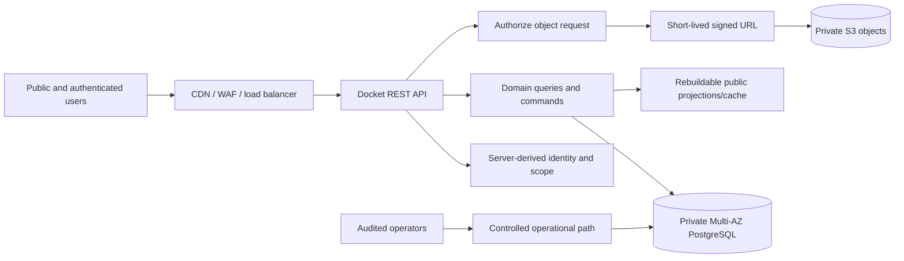
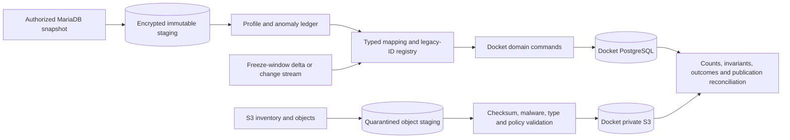

# Tabroom Data Clone Capacity and Workload

## Executive decision

The Tabroom data domain is feasible to reproduce in Docket. Storage capacity is not the limiting factor. The limiting factors are obtaining an authorized production export, translating hidden semantics into Docket's explicit model, reconciling tens of millions of historically inserted competition records, migrating separately stored files, and proving that the resulting records produce the same—or deliberately redesigned—outcomes.

The production recommendation is:

- **Cloud PostgreSQL for authoritative relational data**—the accepted Docket topology uses private Multi-AZ Amazon RDS PostgreSQL.
- **Private cloud object storage for file bodies**—the accepted topology uses encrypted, versioned Amazon S3 with explicit lifecycle rules.
- **Local PostgreSQL and S3-compatible storage only for development**, using generated or sanitized subsets rather than production data.
- **Application/API access for people and clients**, never direct database credentials. Docket services reach PostgreSQL over a private network; authorized file access uses short-lived object URLs.
- **A Docket-owned schema plus a compatibility importer**, not a table-for-table MariaDB clone as the permanent backend.

A complete production-data size cannot be determined from the public repositories. They contain source code, schema definitions, and a substantial test fixture, but not the full production database or S3 bucket. The first hard feasibility gate is therefore data authority and inventory: without an authorized database export and object inventory, “clone everything” means only cloning publicly visible projections, not Tabroom's private or complete historical state.[1][2]

## What “clone everything” can mean

Five distinct assets must not be collapsed into one estimate:

| Asset | Publicly available? | Size known? | Docket treatment |
| --- | --- | --- | --- |
| Application source | Yes | Yes; small | Research input only; direct reuse has architectural and licensing implications. |
| Database structure | Yes | Yes; 108-table MariaDB schema | Translate concepts into Docket-owned PostgreSQL schemas and constraints. |
| Production relational records | No full export found | No | Requires authorized, consistent database dump or migration feed. |
| Uploaded/generated file bodies | No | No | Requires bucket/object inventory and authorized transfer; store separately in S3. |
| Behavior/API compatibility | Partly observable | Scope-dependent | Reproduce only capabilities and contracts that Docket actually requires. |

There are consequently four practical project scopes:

1. **Schema clone:** reproduce the 108 MariaDB tables and load a compatible dump. This is comparatively quick, but it preserves Tabroom's weaknesses and is not the recommended Docket architecture.
2. **Data clone:** migrate the current contents of those tables and files. This requires access to the production data and extensive validation.
3. **Functional clone:** reproduce the behavior encoded outside the schema—in settings, Perl/Mason components, Express code, raw SQL, authorization, and calculation routines. This is much larger than a data copy.
4. **Docket-native reproduction:** preserve historical facts and important outcomes in a redesigned PostgreSQL model, with an independent API and frontend. This is the recommended scope.

## Measured evidence from the repositories

The following values were measured from the pinned repositories used in the architecture investigation. They describe source artifacts, not production storage.[1][2][3]

| Artifact | Measured size or count | Meaning |
| --- | ---: | --- |
| Legacy `tabroom` working files | 41,023,609 bytes | Source checkout excluding `.git`. |
| `Tabroomv4` working files | 52,877,780 bytes | Source checkout excluding `.git`; includes the large test dump. |
| Combined working files | 93,901,389 bytes, about 89.6 MiB | The application source itself is operationally tiny. |
| Combined local checkouts including Git metadata | 140,214,843 bytes, about 133.7 MiB | Code-history storage is still immaterial. |
| Legacy `current-schema.sql` | 101,028 bytes; 2,464 lines | Defines 108 tables; the DDL itself is tiny. |
| `Tabroomv4/indexcards/tests/test.sql` | 43,769,346 bytes raw | MariaDB test database imported by the documented test setup. |
| Same test dump, gzip-compressed in the measurement | 7,894,862 bytes | Illustrates that logical SQL dumps compress strongly. |
| Populated fixture tables | 88 | A broad but not complete production-data representation. |
| Approximate fixture rows | 365,452 | Counted from row tuples in the checked-in dump. |
| Fixture tournament rows | 10 | The fixture is selected test data, not a statistically representative ten-tournament sample. |

The fixture's largest populations are approximately 76,823 Scores, 52,885 Ballots, 52,517 Ratings, 18,702 Results, 13,655 Persons, 9,695 Judge-pool memberships, 9,476 Strikes, 9,327 Panels, 8,467 Judges, 8,231 Entry-Student memberships, and 6,123 Entries.[1]

More importantly, table options in the fixture preserve high next-identity values:

| Table | Next `AUTO_INCREMENT` in fixture | Safe interpretation |
| --- | ---: | --- |
| `tourn` | 40,324 | At least this identifier range has been consumed. It does not prove 40,323 live rows. |
| `person` | 958,990 | Near-million cumulative Person identities. |
| `student` | 1,862,580 | Million-scale competitor identities. |
| `school` | 882,494 | Large tournament-delegation history. |
| `entry` | 7,358,068 | Multi-million cumulative Entries. |
| `judge` | 2,860,392 | Multi-million tournament-local Judge records. |
| `round` | 1,529,130 | Million-scale Rounds. |
| `panel` | 9,017,557 | Multi-million pairings/sections. |
| `ballot` | 52,436,090 | Tens of millions of cumulative Ballot identities. |
| `score` | 65,469,066 | Tens of millions of cumulative Score identities. |
| `result` | 10,566,108 | Multi-million materialized Result identities. |

These are cumulative identifier counters, not current row counts. Deletes, failed inserts, reseeding, and fixture extraction can create gaps. They nevertheless establish the correct order of magnitude for migration engineering: tens of millions of core rows are plausible, while billions are not evidenced by the repository.

The public repositories provide no equivalent byte measurement for the live MariaDB data/index files, logical backups, binary logs, or S3 objects. Any single “Tabroom is X GB” number before receiving those inventories would be invented.

## Planning envelope for relational storage

### Evidence-based range, not a claimed production measurement

The large identity counters and compact row shapes make a **tens-to-low-hundreds-of-gibibytes relational dataset plausible**. Long text, settings, messages, result payloads, indexes, and retained audit/version history are the main uncertainty. A prudent Docket planning envelope is:

| Stage | Relational capacity envelope | Use |
| --- | ---: | --- |
| Local development | 10–30 GiB | Generated fixtures and a small sanitized subset. |
| Initial cloud staging before a full source inventory | 100 GiB, autoscaling enabled | Mapping and representative import work; not a promise that the full clone fits. |
| Broad historical migration planning case | 100–300 GiB final PostgreSQL footprint | Core relational history plus Docket indexes and explicit history. |
| Conservative high case | 500 GiB–1 TiB final | Long-form settings/messages/audit, broad compatibility preservation, or unexpectedly dense source data. |
| Temporary migration workspace | 2.5–4 times expected final PostgreSQL footprint | Source staging, destination heap and indexes, WAL, index builds, reconciliation tables, and safety headroom. |

For example, a forecast of 250 GiB of final PostgreSQL data should receive roughly 625 GiB–1 TiB of temporary migration capacity. After the import is accepted and source staging expires under policy, steady-state allocated storage can be reduced only through a database rebuild or migration; Amazon RDS storage autoscaling grows but does not shrink allocated storage.[9]

This envelope is small relative to the platform limits. PostgreSQL documents no fixed database-size limit and a default maximum of 32 TB per relation, subject to practical resource limits.[6] Amazon RDS for PostgreSQL currently offers General Purpose SSD storage from 20 GiB to 64 TiB.[7] Docket is therefore much more likely to encounter poor query plans, lock contention, excessive indexes, connection pressure, or bad retention rules before it reaches a hard storage ceiling.

### Required sizing calculation after data access

Obtain these values from the source MariaDB instance or a restored production snapshot:

| Input | Required measurement |
| --- | --- |
| Table population | Exact or validated approximate row count by table. |
| Table bytes | `data_length` and `index_length` by table from `information_schema.tables`. |
| Largest values | Maximum and percentile text/blob sizes for settings, invitations, email, comments, and result payloads. |
| Growth | Monthly row and byte growth for at least one full competition season. |
| Churn | Update/delete rates that drive WAL, vacuum, versioning, and migration change capture. |
| Hot set | Current-season and active-tournament rows versus cold history. |
| Integrity | Orphan counts, duplicate natural keys, invalid states, and unknown setting tags. |

Use the source's actual data and index bytes as the baseline, then benchmark a representative import. Do not assume MariaDB and PostgreSQL occupy the same bytes. Docket's UUIDs, explicit histories, additional constraints, different indexes, and typed replacement for EAV settings will change the footprint.

A useful planning equation is:

```text
final PostgreSQL = translated row data
                 + indexes
                 + retained versions/audit
                 + ordinary free-space headroom

migration capacity = final PostgreSQL
                   + immutable source staging
                   + index-build and sort workspace
                   + WAL/change-capture allowance
                   + 25–30% safety headroom
```

## Object and file storage

Tabroom stores file metadata in MariaDB but file bodies in S3. The public repository does not contain those objects, so object storage may be larger than the relational database and cannot be inferred from the 259 `file` rows in the selected test fixture.[2][3]

The source owner must provide either an S3 Inventory report or equivalent object manifest containing, at minimum:

- bucket and object key;
- exact byte size;
- current/noncurrent version status;
- checksum or ETag limitations;
- encryption status;
- storage class;
- last-modified time;
- corresponding database `file` identity or owning entity;
- legal-hold, retention, or deletion constraints.

S3 Inventory is specifically designed to produce scheduled CSV, ORC, or Parquet object-and-metadata listings without driving a synchronous `List` workload against the bucket.[12] Storage Lens can independently report total bytes, current and noncurrent bytes, and object counts.[11]

Object-storage sizing is straightforward once the inventory exists:

```text
current object bytes = sum(size of authorized current source objects)
transfer allowance   = current bytes + retry/verification workspace
steady cloud bytes   = current objects + retained noncurrent versions
```

Illustrative arithmetic—not an estimate of Tabroom's bucket:

| Object population | Average object size | Current bytes |
| ---: | ---: | ---: |
| 100,000 | 1 MiB | about 98 GiB |
| 1,000,000 | 1 MiB | about 977 GiB |
| 1,000,000 | 5 MiB | about 4.8 TiB |
| 2,000,000 | 10 MiB | about 19.1 TiB |

Versioning must be included in cost and retention design because each S3 object version is stored as a complete object, not a delta.[13] Docket should use immutable opaque object keys for most generated/imported artifacts, verify checksums, and apply lifecycle rules that honor the existing permanent, seven-year, two-year, thirty-day, and seven-day retention classes.[4]

## Total managed-storage footprint

“Data size” and “managed footprint” are different. A resilient cloud system stores more physical copies than its logical dataset:

```text
managed footprint ≈ primary PostgreSQL allocation
                  + Multi-AZ standby allocation
                  + backups/PITR and retained snapshots
                  + temporary migration staging
                  + current S3 objects
                  + retained S3 object versions
                  + isolated staging/test subsets
```

Multi-AZ RDS maintains a synchronous standby in a different Availability Zone for availability; that standby is not a read-scaling replica.[8] Point-in-time recovery creates another instance when restored and depends on the configured backup-retention window.[10]

Illustrative planning scenarios:

| Scenario | Final relational data | Current objects | Approximate managed footprint during migration | Confidence |
| --- | ---: | ---: | ---: | --- |
| Docket-native core history | 100 GiB | 100 GiB | 0.5–1 TiB | Planning case only |
| Broad historical import | 250 GiB | 1 TiB | 2–3 TiB | Reasonable capacity envelope, not source measurement |
| File-heavy complete archive | 500 GiB | 10 TiB | 12–20 TiB | Stress envelope until object inventory exists |

These ranges are capacity reservations, not assertions about Tabroom's current bill or footprint. Cloud object storage does not require preallocating its full capacity. RDS does require deliberate initial and maximum storage settings; autoscaling helps with gradual growth but should not be relied upon to rescue an unexpectedly large bulk import.[9]

## Cloud versus local storage

### Recommendation

Use **cloud storage for production and local storage for development**. This is the existing accepted Docket direction and remains the strongest recommendation after sizing.[4][5]

| Criterion | Local production PostgreSQL/files | Managed cloud PostgreSQL + S3 |
| --- | --- | --- |
| Initial experimentation | Excellent | Good, but costs begin immediately |
| Internet accessibility | Requires exposed networking, VPN, DNS, certificates, and redundant ISP | Designed for private application connectivity and public API delivery |
| Active-tournament availability | Requires duplicate hardware, power, network, failover, and on-call operations | Multi-AZ provides managed synchronous standby/failover support |
| Recovery | Must design, operate, isolate, and regularly restore backups | Managed backups/PITR plus required restore exercises |
| Storage growth | Hardware purchase and migration | Online expansion and configurable autoscaling |
| File durability | Requires multiple off-site copies | S3 Standard is designed for 99.999999999% durability and 99.99% availability annually.[13] |
| Security | Full responsibility for perimeter, patching, disks, keys, and physical access | Shared responsibility, private VPC, KMS, IAM, managed patching options |
| Operations labor | High and continuous | Lower, though observability, access, cost, and recovery still require ownership |
| Offline tournament operation | Potential local advantage, but synchronization becomes a hard distributed-systems problem | Requires an explicitly designed offline workflow, not a second writable authority |

A single local server is not appropriate for Docket's accepted targets of 100 simultaneous active tournaments, 20,000 Sessions, 1,000 aggregate requests per second, 100 critical writes per second, 99.95% active-window availability, a five-minute recovery-point objective, and a thirty-minute recovery-time objective.[5]

Local infrastructure is useful for:

- developer PostgreSQL;
- generated fixtures;
- the checked-in Tabroom test corpus after privacy review;
- repeatable migration tests;
- short-lived, encrypted, sanitized source extracts;
- local S3-compatible behavior testing.

It should not hold the only production copy, a casually downloaded production dump, or an independently writable “backup” that can diverge from cloud authority.

## Accessibility model

“Accessible” should mean available through a governed interface—not that the database is reachable from a browser or developer laptop.



Recommended access boundaries:

| Actor | Access |
| --- | --- |
| Public visitor | Public tournament, schedule, pairing, and publication projections through HTTP; no database access. |
| Competitor/Judge/Coach | Permission-filtered API projections and commands derived from current server-side authority. |
| Tournament staff | Tournament-scoped commands and operational projections; all privileged actions attributable and audited. |
| Backend/worker | Least-privilege database roles over private TLS connections. RDS supports requiring SSL/TLS and certificate verification.[14] |
| File consumer | API authorizes the request, then provides a short-lived presigned object URL; presigned URLs grant time-limited access without changing bucket policy.[15] |
| Engineer/operator | No routine production-data browsing. Time-bounded, audited access through a controlled network path and role. |
| Analytics | Read replica or separately governed projection only when workload proves it necessary; never use the Multi-AZ standby as a read replica.[8] |

## Data retrieval design

The retrieval design should follow user questions, not legacy table boundaries.

### Main read paths

| Read path | Source and indexing strategy |
| --- | --- |
| Tournament directory | Compact public projection indexed by season/date/status/geography/circuit; cache at the edge. |
| School history | School identity plus tournament-delegation and publication projections, keyed by canonical School and season. |
| Tournament dashboard | Tournament-scoped aggregates; avoid loading all ballots/scores into one response. |
| Pairings and schedule | Tournament/Event/Round composite indexes; immutable publication version for public reads. |
| Judge assignments | Tournament/Judge/Round indexes plus current authority checks; private projection. |
| Ballot retrieval | Exact Ballot identity or tournament/round/entry/judge composite indexes; separate current state from immutable revision history. |
| Standings/results | Precomputed, versioned publication snapshots derived from Ballots/Scores; public reads should not recompute an entire tournament. |
| Legacy lookup | Unique `(source_system, entity_type, legacy_id)` mapping, resolving into Docket UUIDs. |
| Search | PostgreSQL text/trigram indexes initially; add a separate search system only after measured need. |
| Analytics | Read replica or exported analytical dataset, isolated from tournament-critical writes. |

### Data-access rules

- The browser never queries PostgreSQL directly.
- The API never accepts a client-selected School or tournament scope as proof of authority.
- Only a module's persistence adapter queries its tables.
- Every high-volume child table carries the owning Tournament identity directly or through a reliably indexed path.
- Public publication rows are immutable and cacheable; corrections create a new version and current pointer.
- Large file bodies do not pass through PostgreSQL.
- Imports call ordinary Docket domain commands after validation; they do not bypass invariants with direct production inserts.
- Read replicas, table partitioning, and external search are later optimizations triggered by measurements. Tens of millions of rows do not by themselves require microservices or a distributed database.

The Docket capability target of 1,000 requests per second and 100 authoritative writes per second is a performance-verification requirement, not a storage-size requirement.[5] It should be tested against representative active-tournament concurrency, hot indexes, connection-pool limits, queue activity, and publication bursts.

## Data acquisition package required from Tabroom

A complete migration cannot begin from GitHub alone. Request an authorized package containing:

1. **Consistent database snapshot**—logical dump or physical snapshot with engine/version, character sets, timezone assumptions, and transaction-consistency method.
2. **Size report**—row counts and data/index bytes by table, total database bytes, binary-log volume, and at least twelve months of growth.
3. **Object inventory**—all authorized buckets/prefixes, current and noncurrent objects, sizes, checksums, encryption, storage class, and ownership linkage.
4. **Schema provenance**—exact application revisions and any production-only schema changes, triggers, events, stored routines, or manual patches.
5. **Settings catalogue**—known tags, owning entity, data type, default, valid values, and behavior.
6. **Integration inventory**—NSDA, email, push, payment, video, identity, export, and partner contracts. Credentials and tokens must be re-provisioned, not copied.
7. **Data-authority statement**—which records may be transferred, retained, displayed, or deleted, particularly minors' data, contact details, Ballot feedback, payment records, and private files.
8. **Change-capture plan**—source freeze window or ordered change stream between the initial snapshot and final cutover.
9. **Domain reviewers**—people who can explain ambiguous settings, malformed historical records, pairing/result differences, and permission intent.
10. **Acceptance baselines**—representative tournaments and expected public/private outputs for reconciliation.

If the source owner provides only public API or website access, Docket can import only the authorized public projection. That is not a clone of Accounts, permissions, private Ballots, contact records, files, operational history, or all competition evidence. Publicly visible pages confirm that tournament invitations, entries, Judges, Pairings, and Results are exposed selectively, not that the entire database is public.[16]

## Migration architecture



Required characteristics:

- imports are restartable and idempotent;
- every source row receives an outcome: imported, merged, rejected, quarantined, or intentionally omitted;
- every transformed identity retains source provenance and legacy ID;
- unresolved permissions fail closed;
- credentials, session tokens, payment secrets, and integration secrets are never migrated as usable credentials;
- source records remain immutable in staging while transformation logic is revised;
- files are verified separately from metadata;
- reconciliation compares domain invariants and published outcomes, not only row totals;
- the production cutover is rehearsed from a production-like snapshot at least twice.

## Work breakdown and estimated time

These are planning estimates with approximately ±50% uncertainty until the production size report, settings catalogue, and compatibility scope exist. They exclude frontend development. Calendar estimates assume decisions and source access are not stalled.

### AI-assistance assumption

The estimates are **not hand-typing estimates**. They assume modern engineering tooling and routine AI assistance, but they do not assume that an AI system can autonomously own production data, settle ambiguous tournament semantics, approve privacy decisions, or certify a migration. The original person-week totals are accountability-adjusted delivery effort: a human team remains responsible for review, evidence, and decisions even when AI generates much of the mechanical code.

AI acceleration varies sharply by work type:

| Work type | Plausible throughput effect | Why |
| --- | ---: | --- |
| Schema scaffolding, adapters, repetitive mappings, fixtures, documentation | 2–4× | Highly parallel and mechanically reviewable once contracts are settled. |
| Repository archaeology, query discovery, mapping drafts | 1.5–3× | AI can search and correlate quickly, but conclusions still need source and domain verification. |
| Import implementation and routine reconciliation tooling | 1.5–2.5× | Good automation target, constrained by representative data and review. |
| Domain-policy decisions, unknown setting interpretation, privacy/licensing, source authorization | 1–1.3× | The bottleneck is accountable human judgment or an external party, not typing. |
| Performance verification, recovery exercises, production rehearsals, anomaly disposition | 1.2–1.7× | AI helps prepare and analyze, but real systems and human acceptance control elapsed time. |

Across the whole project, one capable owner working closely with AI should plan for roughly a **30–50% calendar reduction** compared with the same owner using conventional tools alone—not a uniform 5× or 10× reduction. AI can generate work while the owner is away, but review throughput, source access, production experiments, and unresolved decisions remain on the critical path.

An AI-assisted solo-owner planning range is therefore:

| Scope | Owner available about 40 hours/week | Owner available about 20 hours/week |
| --- | ---: | ---: |
| Representative data-spine proof | 4–8 weeks | 2–4 months |
| Canonical schema plus core importer | 5–8 months | 10–16 months |
| Production-grade core backend and broad migration | 10–18 months | 20–36 months |
| Near-complete long-tail Tabroom parity | 18–30+ months | 3–5+ years |

These ranges assume the owner is already technically capable of reviewing database, backend, security, and migration work. If the owner must learn those disciplines while building, or if no tournament-domain reviewer is available, use the upper bound or add specialist support. A single owner plus AI is also not equivalent to a three-person team during production migration: independent review, incident response, domain adjudication, and cutover coverage cannot safely be parallelized into one accountable person.

### Progressive launch with deferred migration

Docket does not need a complete Tabroom historical import or all legacy-shaped capabilities before it becomes usable. It can begin with the permanent data foundation and one production-quality vertical slice, collect new Docket-native data immediately, and add later modules through module-owned, backward-compatible migrations. Historical Tabroom data can then be imported through the staging and compatibility boundary described above.

This changes time-to-value more than it changes ultimate full-parity effort. The following ranges assume one capable owner working intensively with AI and exclude frontend effort beyond the minimum interface needed to exercise the backend:

| Progressive milestone | Full-time owner | About 20 owner-hours/week | Cumulative outcome |
| --- | ---: | ---: | --- |
| Permanent foundation and representative data-spine proof | 4–8 weeks | 2–4 months | PostgreSQL ownership, identity/authority seams, audit/provenance, migrations, recovery baseline, and representative relationships are proven. |
| First production-usable narrow workflow | 3–5 months cumulative | 6–10 months cumulative | New Docket users can perform one complete bounded workflow without Tabroom history. |
| Broad Docket-native core, still without historical import | 6–10 months cumulative | 12–20 months cumulative | Most selected operational modules store and retrieve new Docket data. |
| Add a broad historical Tabroom migration while the product remains live | 5–10 additional months | 10–20 additional months | Staging, mappings, reconciliation, live-data merge rules, rehearsals, and cutover add history safely. |
| Progressive core plus broad historical migration | 11–20 months total | 22–40 months total | Similar end capability to the production-grade migration scope, reached after an earlier usable launch. |

Compared with waiting for the production-grade core and broad migration before launch, the progressive approach can put a narrow workflow in users' hands roughly **7–13 months earlier** for a full-time owner. Its total broad-migration effort is likely **about 5–20% higher**, because a live product requires adjacent-release compatibility, online backfills, dual-shape read/write periods, merge rules for records created during migration, and more operational rehearsals. If historical Tabroom data is never imported, the project avoids that later 5–10 month migration increment rather than paying the compatibility premium.

The ranges depend strongly on the first workflow. Identity, School authority, Tournament ownership, one registration path, API authorization, audit, backups, and recovery form a plausible narrow slice. Pairing, ballots, standings, complete results, finance, files, and every historical edge case are not one narrow slice and should remain later increments.

### Owner planning target: 4.5-month Texas data pilot

On September 12, 2026, the owner selected a provisional 4.5-month target for a usable Docket backend with live-safe, selective Tabroom migration focused first on Texas Schools. This is a planning target, not an authorization to build and not a change to the accepted Release 1 scope or work graph.

For this target, “Texas teams” should be translated into Docket's existing domain language as canonical **Schools** located in Texas, their tournament-specific **Entries**, and selected School history. It should not create a new generic Team entity. The first migration tier should include public or otherwise authorized School identity, aliases, participation, and published outcome history. Named Competitor history, full Pairings, Ballots, Scores, Judge-linked data, private feedback, contacts, billing, and files are separate restricted or high-complexity tiers.

The selective importer needs an explicit dependency-closure rule. A Texas Entry may have attended an out-of-state Tournament or faced an out-of-state opponent. Docket should import the minimum authorized Tournament, Event, season, and public opponent context required to interpret the Texas School's history without automatically broadening the migration to every connected private record.

The 20-week full-time plan is:

| Weeks | Owner-hours | Workstream | Exit condition |
| --- | ---: | --- | --- |
| 1–2 | 80 | Scope and source access | Authorized source, Texas inclusion rule, migration tiers, three representative tournaments, diverse pilot Schools, and field-level mapping ledger exist. |
| 3–6 | 160 | Permanent platform foundation | Repository/runtime foundation, PostgreSQL and module-owned migrations, environments, identity and authority seams, audit, provenance, retention, backups, and recovery baseline exist. |
| 7–10 | 160 | First Docket-native vertical slice | Account → School authority → Tournament/Event setup → Entry registration → permission-filtered API retrieval works end to end. |
| 11–14 | 160 | Selective migration framework | Immutable staging, import batch/scope records, source-key registry, idempotent upserts, dry run, conflict quarantine, dependency closure, and reconciliation reporting work against representative fixtures. |
| 15–17 | 120 | Texas School History v1 | Reviewed canonical Texas School and alias matches plus the authorized public participation/result tier import successfully for a diverse pilot set; clean source records may then expand by scope rather than custom code. |
| 18–20 | 120 | Live coexistence and production hardening | Online import rehearsal, native-write precedence, delta/watermark behavior, rollback/forward-fix, security, load, recovery, monitoring, and go-live review pass for the bounded pilot. |

Total planned owner capacity is approximately **800 hours** plus AI generation and analysis. The schedule requires prompt source access and full-time owner availability. At 30 owner-hours per week, the same scope is about six to seven months; at 20 hours per week, about nine to ten months. A 20-hour/week owner can still hold the 4.5-month date only by reducing the pilot to the foundation, the narrow workflow, the reusable importer skeleton, and approximately three to ten manually reviewed Texas Schools using public-history fixtures.

The import operation should be batch-selective rather than claim real-time replication: choose School IDs, seasons, and migration tier; create a versioned immutable source snapshot; dry-run; import idempotently; reconcile; and publish the batch outcome. If Tabroom continues changing and authorized delta exports exist, periodic watermarked delta batches can follow. Real-time change-data capture, Tabroom/Docket dual writes, and automatic identity merges are outside this pilot because they add substantial operational and correctness risk.

The 4.5-month target remains feasible only if the historical scope stops at School setup and public/authorized participation and result history. Adding named Competitors and complete Entry composition is likely another four to eight full-time weeks after privacy and identity rules are settled. Full Pairings, Ballots, Scores, Judge-linked evidence, feedback, and files add roughly three to six or more months and belong after the pilot.

### Work packages

| Work package | Typical effort | Primary output |
| --- | ---: | --- |
| Data rights, source access, licensing/privacy decisions | 1–3 person-weeks; 2–8+ elapsed weeks | Authorized scope and transfer mechanism |
| Production inventory and profiling | 2–4 person-weeks | Exact rows/bytes/growth/object inventory/anomaly baseline |
| Canonical Docket schema and mapping ledger | 6–10 person-weeks | Module-owned PostgreSQL model and source-to-target field rules |
| Immutable staging, import orchestration, and legacy-ID registry | 5–8 person-weeks | Restartable migration framework |
| Identity, Schools, people, permissions | 6–10 person-weeks | Deduplicated identities and reviewed authority translations |
| Tournaments, configuration, scheduling resources | 5–8 person-weeks | Tournament/Event/Round/time/site/room structures |
| Registration, Entries, Competitors, Judges, finance essentials | 7–12 person-weeks | Participation history and registration state |
| Pairings, pools, ratings, strikes, conflicts, assignments | 7–12 person-weeks | Reproducible competition setup and assignments |
| Ballots, Scores, corrections, standings, results, awards | 10–16 person-weeks | Competitive evidence and outcome parity |
| Settings catalogue and long-tail tables | 8–16 person-weeks | Typed replacements, quarantined unknowns, approved omissions |
| File/object migration | 3–10 person-weeks | Verified private objects and metadata linkage |
| API retrieval projections and indexing | 8–14 person-weeks | Stable Docket read/write boundary independent of UI |
| Reconciliation and domain acceptance | 8–14 person-weeks | Counts, anomaly dispositions, golden outcomes, sign-off |
| Security, retention, backup, recovery, observability | 6–10 person-weeks | Production data controls and recovery evidence |
| Performance and capacity verification | 4–8 person-weeks | Proven workload envelope and tuned indexes/resources |
| Rehearsals, delta capture, cutover, and rollback | 4–8 person-weeks | Repeatable migration and accepted cutover |

Several packages overlap with a team. Straight addition yields roughly **90–160 person-weeks** for a broad, production-grade Docket-native migration backend. The long tail of every Tabroom table, setting, route, historical anomaly, and integration can increase this to approximately **30–50 person-months**.

### Calendar estimates by scope

| Scope | Solo experienced engineer | Focused 3-person engineering team plus part-time domain/SRE/privacy support | Result |
| --- | ---: | ---: | --- |
| Exact MariaDB schema and basic dump loader | 1–2 months | 2–4 weeks | Structural clone only; not a safe Docket backend |
| Docket canonical schema plus core-entity importer | 8–12 months | 4–6 months | Data spine and repeatable core history import |
| Production-grade core backend and broad historical migration | 18–30 months | 7–12 months | Secure APIs, core competition history, files, reconciliation, operations |
| Near-complete “everything Tabroom does” backend parity | 30–48+ months | 12–20+ months | Long-tail settings, integrations, finance, administrative and compatibility behavior |

Adding engineers does not divide time linearly because the canonical model, ambiguous mappings, permission policy, and result reconciliation require shared decisions. A practical minimum team is:

- one senior data/backend architect;
- two backend/data engineers;
- one empowered tournament-domain expert, at least part time;
- one SRE/security engineer, part time early and heavier near production;
- privacy/legal review at acquisition, mapping, retention, and cutover gates.

The estimates assume Docket reuses its already accepted architectural decisions. Reopening the database, language, module, identity, API, or operations stack would add decision and rework time.

## Recommended delivery sequence

### Gate 1 — prove acquisition, one to four weeks of technical work

- Obtain a redacted size report and S3 inventory before requesting the full data.
- Freeze the source revision and compatibility scope.
- Identify records Docket is legally and operationally permitted to receive.
- Select three representative tournaments: small, large, and operationally irregular.

**Stop condition:** if full source authority is unavailable, redefine the project as public-data import or functional reimplementation. Do not continue calling it a full data clone.

### Gate 2 — prove the data spine, six to ten weeks

- Finalize the canonical identity, School, tournament, Entry, Judge, Round, Pairing, Ballot, Score, and Publication relationships.
- Import the representative tournaments into immutable staging.
- Produce the first anomaly ledger and legacy-ID map.
- Measure actual PostgreSQL heap/index bytes and import throughput.

**Decision produced:** a defensible full-size estimate, target RDS allocation, object-transfer plan, and narrowed delivery forecast.

### Gate 3 — build core import and retrieval, three to six additional months with a focused team

- Complete module-owned schemas, migrations, and adapters.
- Complete core transformation pipelines.
- Build public, participant, School, Judge, and tournament-staff projections.
- Reconcile Ballots, Scores, Pairings, standings, and published results.
- Exercise retention and authorization boundaries.

### Gate 4 — productionize and rehearse, two to four additional months

- Run representative capacity, queue, and recovery scenarios.
- Complete object transfer and checksum reconciliation.
- Rehearse full snapshot plus final delta at least twice.
- Confirm rollback/cutback, observability, privacy deletion, and production access procedures.

### Gate 5 — optional long-tail parity, three to nine additional months

- Add only proven compatibility surfaces, integrations, obscure settings, finance/administrative features, and historical displays.
- Record intentional differences rather than silently imitating accidental legacy behavior.

## Immediate sizing request

Before backend implementation begins, the highest-value next artifact is a **Tabroom source inventory**, not another speculative schema. Ask the authorized source operator for:

```text
Database engine/version and full schema hash
Total database data bytes and index bytes
Row count, data bytes, and index bytes by table
Largest 25 tables by bytes and rows
Twelve months of database growth and binary-log volume
Consistent sample dump for three representative tournaments
Total S3 current bytes and object count
Total S3 noncurrent/version bytes and object count
Object inventory with key, size, checksum, encryption, and owner mapping
Permitted data classes and prohibited migrations
Available freeze window or change-capture mechanism
```

With those values, the broad 100–300 GiB relational planning range can be replaced by an estimate with roughly ±20% storage confidence, and the file-transfer duration can be calculated directly.

## Transfer-time reference

Ignoring protocol overhead and assuming the connection sustains 70% of its nominal rate:

| Data transferred | 100 Mbps connection | 1 Gbps connection |
| ---: | ---: | ---: |
| 100 GiB | about 3.4 hours | about 20 minutes |
| 1 TiB | about 35 hours | about 3.5 hours |
| 10 TiB | about 14.5 days | about 35 hours |

Database conversion, index construction, checksum validation, retries, and source throttling usually make end-to-end migration slower than network transfer alone. Object copies can be parallelized; ordered relational imports and index builds are constrained by database CPU, memory, I/O, locks, and WAL generation.

## Final feasibility judgment

The backend is feasible, and the expected record scale fits comfortably inside PostgreSQL and managed RDS limits. The likely relational dataset is manageable on ordinary managed-database infrastructure; even the conservative 1 TiB planning case is far below RDS's current 64 TiB General Purpose SSD ceiling.[7] Files belong in S3 and may dominate total bytes, but S3 capacity itself is not a practical blocker.

The safest conclusion is not “copy 108 tables.” It is:

1. obtain authorized source and object inventories;
2. build Docket's canonical PostgreSQL data spine;
3. preserve source IDs and raw staging;
4. migrate through validated domain commands;
5. expose records through scoped APIs and immutable publication projections;
6. use cloud production storage with local development replicas;
7. benchmark representative imports before committing to a final storage number or cutover date.

If the immediate constraint is data structure, Gate 2 is the decisive investment. In approximately six to ten weeks, a focused team can turn the current architectural understanding into a measured canonical schema, mapping ledger, representative import, and evidence-based total-capacity forecast—without building the UI and without prematurely committing Docket to Tabroom's legacy database.

## Sources

[1] Speech and Debate Association, [`Tabroomv4` test database](https://github.com/speechanddebate/Tabroomv4/blob/0fe17ddafca242ddd9c5e2688b93dc9e443696ee/indexcards/tests/test.sql) and [`indexcards` setup instructions](https://github.com/speechanddebate/Tabroomv4/blob/0fe17ddafca242ddd9c5e2688b93dc9e443696ee/indexcards/README.md), revision `0fe17ddafca242ddd9c5e2688b93dc9e443696ee`.

[2] Speech and Debate Association, [legacy Tabroom repository](https://github.com/speechanddebate/tabroom/tree/b3a71a065f36cab222e55521b8827a1ed829bca9), including [`current-schema.sql`](https://github.com/speechanddebate/tabroom/blob/b3a71a065f36cab222e55521b8827a1ed829bca9/doc/sql/current-schema.sql), revision `b3a71a065f36cab222e55521b8827a1ed829bca9`.

[3] Docket, [Tabroom architecture investigation](tabroom-architecture-investigation.md), especially storage architecture, entity relationships, data access, compatibility, and unknowns.

[4] Docket, [Tournament Record Retention Model](../../wiki/retention-model.md) and [Backend Architecture](../../wiki/backend-architecture.md).

[5] Docket, [Release 1 Capability Targets](../quality/release-1-gates.md) and [Release 1 Operations Contract](../operations/release-1.md).

[6] PostgreSQL Global Development Group, [PostgreSQL Limits](https://www.postgresql.org/docs/current/limits.html), accessed September 12, 2026.

[7] Amazon Web Services, [Amazon RDS for PostgreSQL pricing and storage ranges](https://aws.amazon.com/rds/postgresql/pricing/), accessed September 12, 2026.

[8] Amazon Web Services, [Multi-AZ DB instance deployments for Amazon RDS](https://docs.aws.amazon.com/AmazonRDS/latest/UserGuide/Concepts.MultiAZSingleStandby.html), accessed September 12, 2026.

[9] Amazon Web Services, [Managing capacity automatically with Amazon RDS storage autoscaling](https://docs.aws.amazon.com/AmazonRDS/latest/UserGuide/USER_PIOPS.Autoscaling.html), accessed September 12, 2026.

[10] Amazon Web Services, [RestoreDBInstanceToPointInTime](https://docs.aws.amazon.com/AmazonRDS/latest/APIReference/API_RestoreDBInstanceToPointInTime.html), accessed September 12, 2026.

[11] Amazon Web Services, [Amazon S3 Storage Lens metrics glossary](https://docs.aws.amazon.com/AmazonS3/latest/userguide/storage_lens_metrics_glossary.html), accessed September 12, 2026.

[12] Amazon Web Services, [Cataloging and analyzing data with S3 Inventory](https://docs.aws.amazon.com/AmazonS3/latest/userguide/storage-inventory.html), accessed September 12, 2026.

[13] Amazon Web Services, [Data protection in Amazon S3](https://docs.aws.amazon.com/AmazonS3/latest/userguide/DataDurability.html) and [S3 Versioning](https://docs.aws.amazon.com/AmazonS3/latest/userguide/Versioning.html), accessed September 12, 2026.

[14] Amazon Web Services, [Using SSL with an RDS for PostgreSQL DB instance](https://docs.aws.amazon.com/AmazonRDS/latest/UserGuide/PostgreSQL.Concepts.General.SSL.html), accessed September 12, 2026.

[15] Amazon Web Services, [Download and upload objects with presigned URLs](https://docs.aws.amazon.com/AmazonS3/latest/userguide/using-presigned-url.html), accessed September 12, 2026.

[16] Tabroom, [Tournament Info help](https://docs.tabroom.com/public/tournament-info), accessed September 12, 2026.
