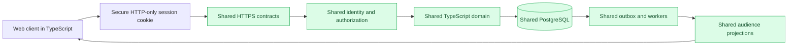
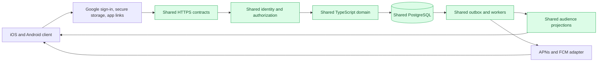
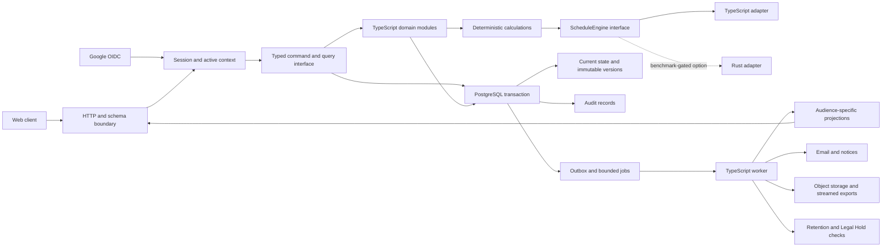

# Backend Implementation Proposal

This page records Docket's accepted backend direction and the remaining implementation decisions for its first complete Lincoln-Douglas tournament lifecycle. The project owner accepted interview decisions Q1–Q9 on 2026-09-04. Acceptance applies to the baseline below, not to every proposed library, repository detail, or unverified performance claim elsewhere on this page. It translates the requirements in [[backend-roadmap]] and the domain-model pages into a build that can be measured and verified.

## Accepted backend baseline

| Decision | Accepted requirement |
| --- | --- |
| Q1 — First release | Prove one complete tournament lifecycle, from invitations through registration, scheduling, Ballots, results, and Closure, before adding all advanced features. Mandatory integrity and authorization rules still apply to that lifecycle. |
| Q2 — Capacity | Verify 10 simultaneous tournaments, 5,000 connected users, and bursts of 200 commands per second. These are test targets, not measured capacity or permanent product limits. |
| Q3 — Operations | Use managed application hosting and managed PostgreSQL; omit Kubernetes initially. |
| Q4 — Budget | As clarified with Q12, cap total monthly production infrastructure at $500, including primary and standby application/worker capacity, PostgreSQL replication, backups, monitoring, object storage, and usage charges. This is a hard design constraint, not a validated quote or spending authorization. |
| Q5 — Region | Launch for US users in one US region. |
| Q6 — Recovery | An acknowledged tournament command must not be silently lost after a server failure. Target recovery within one hour after a major infrastructure failure. The covered failure scenarios still need explicit definition and verification. |
| Q7 — Structure | One modular TypeScript monolith, separate HTTP and worker processes, and one PostgreSQL database. Keep Rust optional behind the scheduling interface and require benchmark evidence before adoption. |
| Q8 — Communication | JSON commands over HTTPS, live web updates, mobile push notifications, and polling fallback. The live-update transport remains to be selected. |
| Q9 — Build gates | Block merges on strict TypeScript, lint, unit tests, real-PostgreSQL integration tests, migration checks, contract tests, and critical lifecycle tests. Pin runtime and dependency versions, prohibit ignored type errors, and require reproducible scheduling fixtures. |
| Q10 — Hosting outage | The owner wants recovery to include an entire hosting-system outage while keeping the codebase small. Whether this means a regional outage or an entire hosting provider remains to be clarified. No particular replication design, data-loss relaxation, additional region/provider, or budget increase has been accepted. |
| Q11 — Recovery time | For an entire cloud-provider outage, recover within one hour, preferably in under fifteen minutes. This resolves Q10's provider-unavailability scope. Deployment selection, measured feasibility, recovery capacity, and cost remain open. |
| Q12 — Recovery priority | Target restoration of live tournament functions in under fifteen minutes to limit round delays and preserve user trust. Reporting and large exports may recover within the one-hour limit. Preserve acknowledged submissions. The monthly infrastructure total must stay at or below $500. |
| Q13 — Automatic failover | Automatically switch to recovery when safety can be verified, with an immediate Platform Administration alert. Preserve acknowledged writes and prevent simultaneous database writers; no operator approval is needed for a verified safe switch. |
| Q14 — Tournament size | Approximately 750 competitors is the launch upper-bound planning target for a single tournament. This sizes representative load, scheduling, and recovery fixtures; it does not establish an enforced registration cutoff or measured capacity. |
| Q15 — Event mix | For representative tournament workload planning, allocate approximately 60% of Entries to speech and 40% to debate. Q16 replaces the initially equal within-category distribution with explicit event weights. This is a fixture assumption, not an enforced registration quota. |
| Q16 — Weighted event catalog | Speech: Informative Extemp and Persuasive Extemp at 20% each, with OO, Prose, Poetry, and Informative Speaking at 15% each. Debate: Congress 30%, LD 30%, CX 25%, PF 15%. |
| Q17 — Extemp name | The first extemp event is Informative Extemp. This corrects the earlier interpretive-extemp wording without changing the event weights. |
| Q18 — Cross-entry workload | A typical speech competitor enters two speech events in the test tournament. Select approximately 30% of debate Entries for cross-entry into one extemp event. Q19 confirms both members of selected CX/PF teams participate. These are fixture assumptions, not automatic participation grants or production registration caps. |
| Q19 — Team cross-entry | Both teammates of each selected CX or PF Entry enter extemp individually. Each teammate has one extemp Entry linked to that person's existing Competitor identity, while the debate Entry remains shared. |
| Q20 — Pairing response target | Target a calculated round pairing within 30 seconds per event/division, with visible progress. Benchmark the target and report failure or timeout explicitly rather than return a pairing that violates required constraints. |
| Q21 — Pairing optimization | Return the best valid candidate found within the calculation budget without requiring proof of global optimality. Every mandatory rule and locked policy still applies; optimize only preferences that policy permits. |
| Q22 — Pairing timeout retry | Show a clear timeout message with a Retry action. An authorized staff member explicitly requests a new bounded attempt; a timeout does not automatically start another search. |
| Q23 — Simultaneous maximum-size tournaments | Test all ten simultaneous tournaments at approximately 750 competitors each: 7,500 tournament participants in aggregate. Keep the separate target of 5,000 concurrently connected users and the accepted event/cross-entry workload. This is a verification requirement, not a measured support claim. |
| Q24 — Peak burst duration | Sustain 200 commands per second for 60 seconds, totaling 12,000 commands, in the initial peak-load scenario alongside Q23's tournament and connected-user workload. |
| Q25 — Ordinary request latency | During the agreed peak test, at least 95% of ordinary backend requests must finish within two seconds. Include check-in and Ballot submission through the backend response; pairing calculations and large exports keep their separate targets. |
| Q26 — Live-update delivery | Target published room, schedule, and pairing changes appearing within five seconds on connected web and mobile screens while the application is actively viewed. Background phone-notification delivery has separate expectations. |

Capacity, recovery, and budget must be demonstrated together on the proposed deployment. No load tests, restore drills, provider quote, or executable backend currently substantiate them. A conflict among these targets must be reported for a product decision rather than silently weakening a target.

Q15 allocation uses Entry count: for E total Entries, assign approximately 0.60E to speech and 0.40E to debate, then apply Q16's weights below within each category. Use integer allocations with a deterministic remainder so category totals and the overall total are preserved. If E were 750, category totals would be 450 and 300; Q14 specified 750 Competitors, so this example is not yet the actual Entry fixture. Cross-entry and team membership affect the relationship between people and Entries. The category mix also does not specify division sizes. The first Lincoln-Douglas lifecycle fixture remains distinct from a later mixed-event load fixture.

The mixed-event workload catalog below was supplied in Q16, superseding the earlier catalog gap. Lincoln-Douglas remains the first end-to-end implementation slice in [[backend-roadmap]]. [[registration-model]] distinguishes Competitors from Entries and permits governed cross-entry. These weights describe representative load; they do not settle event rules or force actual tournament registrations into these proportions.

| Category | Event | Share within category | Share of all Entries |
| --- | --- | --- | --- |
| Speech | OO | 15% | 9% |
| Speech | Prose | 15% | 9% |
| Speech | Poetry | 15% | 9% |
| Speech | Informative Extemp | 20% | 12% |
| Speech | Persuasive Extemp | 20% | 12% |
| Speech | Informative Speaking | 15% | 9% |
| Debate | Congress | 30% | 12% |
| Debate | LD | 30% | 12% |
| Debate | CX | 25% | 10% |
| Debate | PF | 15% | 6% |

Each category's internal weights sum to 100%; the combined weights sum to 100% of Entries. Q17 resolves the first extemp name as Informative Extemp, distinct from Informative Speaking.

Q18 links the same Competitor to multiple Entries rather than duplicating identity records. Model two distinct speech events for the typical speech competitor and one of Informative Extemp or Persuasive Extemp for cross-entering debate participants. The 30% selection denominator is debate Entries as stated by the owner. Under Q19, each selected CX/PF team contributes two individual extemp Entries, while each selected individual debate Entry contributes one. Selection is counted once per debate Entry, not once per teammate. The distribution of those selected participants between the two extemp events also remains to be set.

Include debate participants' extemp Entries within the accepted speech event totals when constructing the fixture, preserving the existing 60%/40% Entry mix rather than adding them after allocation. This is the current fixture interpretation, not a change in the stated weights. The two-speech-event assumption applies to typical speech competitors; debate cross-entry adds one extemp event for each participating debate Competitor. The fixture must satisfy approximately 750 unique Competitors and the Entry weights together, accounting for two-person CX/PF teams and both teammates' cross-entry. Validate each teammate's schedule separately; shared debate participation does not merge their individual extemp assignments.

Use the existing [[registration-model]] cross-entry authorization and schedule-compatibility rules. Test that ordinary unapproved overlaps are rejected and that approved cross-entry holds obey their limits across schedule revisions, pairing publication, and recovery. The workload percentage grants no exemption from these rules.

Q12 recovery planning prioritizes the live command path and its dependencies. The proposed verification scope includes sessions and authorization, current schedules and Pairings, rooms, check-in, Judge assignments, Ballot submission, and the calculations and publication needed to advance rounds. Only nonessential reporting and large exports are deferred; required security and data-integrity checks remain operative. The final acceptance fixture must exercise the complete path at the agreed recovery load. Routine process crashes should recover faster where possible; the disaster target is not a delay to wait before restarting.

Hosting-outage protection can preserve the same TypeScript domain implementation and one logical PostgreSQL database while adding physical database replicas and a recovery deployment. Keep replication and promotion in the infrastructure layer; application responsibilities include connection recovery, bounded retries, duplicate-command protection, and durable jobs. See [[backend-disaster-recovery]] for sourced tradeoffs. Replicas must be outside the failure being covered. A second region of the same provider does not by itself cover a provider-wide outage, and asynchronous copies cannot satisfy the accepted no-loss promise for transactions that have not reached the surviving copy.

## Interview design tree

The documentation-backed grilling interview is defining the backend before implementation. Settled branches and their next dependent decisions are:

- Complete first lifecycle → exact release requirement ledger and representative tournament fixtures.
- Capacity target, approximately 750 competitors per tournament, a 60-second burst, and two-second ordinary-request p95 → division distribution, remaining cross-entry details, read/write mix, connected-user behavior, and live-update delay.
- Managed hosting, US region, and pilot budget → provider comparison, concrete resource sizing, and cost validation.
- Acknowledged-write durability and one-hour recovery → covered failure scenarios, replication requirements, failover, backup restoration, and evidence from recovery drills.
- Modular TypeScript and PostgreSQL → HTTP/schema libraries, SQL and migration tooling, module interfaces, and transaction rules.
- Shared HTTPS contracts and a five-second foreground live-update target → transport, reconnect behavior, mobile contract compatibility, and background notification expectations.
- Required merge gates → executable checks, requirement coverage, and controlled performance baselines.

Implementation remains a later stage of the interview; accepted recommendations here authorize documenting the design, not provisioning paid infrastructure.

## Accepted architecture shape

Begin with a modular TypeScript monolith compiled for a pinned Node.js LTS runtime. Run the HTTP application and background worker as separate processes from the same repository and release. Use PostgreSQL as the transactional source of truth and job queue, and use object storage for generated exports and restricted large payloads.

Keep scheduling behind a narrow `ScheduleEngine` interface. Ship the TypeScript adapter first. A Rust adapter may replace it only if representative benchmarks show that scheduling cannot meet an accepted resource budget in TypeScript. Both adapters must consume and return the same versioned, runtime-validated contract and pass the same golden fixtures.

## Web and mobile clients

Adding downloadable iOS and Android applications does not require a second domain backend. The web client and mobile client should call the same versioned HTTPS command and query interface and receive the same audience-specific projections. The PostgreSQL model, authorization rules, domain modules, audit records, workers, retention, and optional Rust scheduling seam remain shared.

The clients need different adapters around that shared interface. The web client uses browser navigation, an HTTP-only secure session cookie, and web notification behavior. The mobile client is one React Native and Expo TypeScript codebase for iOS and Android, built with Expo development builds rather than Expo Go. It uses the platform Google sign-in flow with Authorization Code and PKCE where applicable, operating-system secure credential storage, universal or app links, and APNs or FCM push delivery. The backend accepts separate registered client audiences but maps the verified Google issuer and subject to the same Docket Account.

The web and mobile interfaces remain separate applications. They share versioned contracts, runtime schemas, the HTTPS client, terminology, and design tokens without forcing desktop and touch layouts through one visual component tree. Expo-supported libraries are preferred for platform functions, with focused Swift or Kotlin modules permitted when a measured need or platform requirement justifies them.

The mobile application serves every Docket actor, including Competitors, Coaches, Judges, Tournament Directors, Tabulation Staff, School Managers, Platform Administrators, and Legal and Privacy Operations personnel. Authentication identifies the Account; current Docket grants determine the available roles and scopes. A user with multiple grants explicitly switches among them through the application UI, with exactly one Active Role Context governing a workspace at a time rather than a combined multi-role workspace. The selected context determines commands, projections, navigation, and required session policy. The client does not infer authority from its installation, device, email domain, or visible navigation.

Each request carries the selected context identifier and the backend revalidates that context against current grants. Switching context must replace role-specific navigation and clear context-scoped client data. The existing unsaved-work guard applies before switching so an unfinished action cannot be silently transferred into another role.

Role creation follows explicit authority paths. A School Manager may invite Coaches and student Competitors only into that Manager's School. Platform Administration staff temporarily grant the single Tournament Administrator authority for a tournament. That authority is the user-facing name for the existing Tournament Owner role, includes Tournament Director capabilities, and may appoint additional Directors and Tabulation Staff. It begins at an attributed effective time, ends automatically in the Tournament Closure transaction, and may be revoked or replaced earlier only by Platform Administration. Authorization fails immediately after the assignment ends, while historical actions keep their original actor attribution. These operations use the same audited, transactionally validated Access Offer and grant mechanisms on web and mobile; neither client may infer a role from an email domain or local state.

Administrative mobile workflows must expose the same validation, approval, publication, recovery, warning, and audit semantics as the web interface. Responsive presentation may differ, but mobile cannot offer a weakened command or bypass merely because screen space is constrained.

Mobile feature delivery is phased while the backend command and projection contracts remain shared. The first mobile release covers role switching, invitations and participation, schedules, Pairings, check-in, Judge assignments, Ballot submission, notices, results, and the urgent approvals or corrections needed during a live tournament. Later mobile releases add complex tournament setup, policy and schedule configuration, bulk roster administration, reporting, exports, platform support, identity review, retention governance, and Legal Hold interfaces. A temporarily web-only interface does not create a web-only domain command or different authorization rule.

The mobile application requires an active internet connection for Docket functionality. It does not support offline Ballot drafting, queued commands, offline schedule access, or later synchronization. A command succeeds only after the server validates and commits it and returns a receipt. Mobile storage is limited to secure session material and transient presentation state; sensitive state must be removed on logout, authority loss, or context switch according to the applicable policy.

Mobile push notifications display useful tournament logistics directly in the notification: tournament identity, round, scheduled start time, room, and competitor names. The backend creates the notification only for an authorized recipient and labels it with the applicable role and tournament context. The payload includes a stable destination identifier so opening it can fetch current server state rather than trusting possibly stale notification text. Ballot contents, scores before authorized release, credentials, contact information, and private administrative details are excluded. The application respects operating-system notification-preview settings.

### Web path



### iOS and Android path





The write path is deliberately short: validate, authenticate, authorize, execute one domain transition, and commit the state version, audit record, and outbox entries in one database transaction. External delivery and large calculations run outside request transactions through bounded jobs. Protected reads use explicit public, Account, School, tournament-staff, and sensitive-evidence projections.

## Repository layout

```text
apps/
  web/                 browser-focused TypeScript interface
  mobile/              React Native and Expo iOS/Android interface
  api/                 HTTP adapter and composition root
  worker/              bounded job processing
packages/
  contracts/           runtime schemas and inferred TypeScript types
  domain/              commands, state transitions, and calculations
  authorization/       active-context and scoped grant policy
  database/            SQL, migrations, transactions, and row decoders
  testkit/             deterministic clocks, IDs, fixtures, and scenario runner
crates/
  scheduler/           optional Rust ScheduleEngine adapter
requirements/
  ledger.yaml          requirement IDs, sources, implementation, and verification
```

Avoid a framework-specific domain model. The HTTP adapter parses untrusted input and calls the same command interface used by tests and administrative tooling. Database rows are decoded at runtime before becoming domain values. SQL remains explicit and reviewable; a large object-relational mapping layer is unnecessary for the first slice.

## Codex working method

Codex works best here when repository instructions state the outcome, constraints, validation commands, and evidence expected from each change. Keep the root `AGENTS.md` concise and add nested instructions only where a module has different commands or invariants.

Every implementation task should name a small vertical behavior, its applicable requirement IDs, allowed side effects, and exact checks. Codex should implement the behavior, run the narrow tests, run the affected integration scenario, inspect the diff, and update documentation from the verified behavior. Difficult calculation work should use a scored loop with machine-readable output so each iteration can be compared.

The repository should provide stable commands such as:

```text
pnpm check             format, lint, and type checking
pnpm test              deterministic unit and property tests
pnpm test:integration  PostgreSQL-backed command scenarios
pnpm test:lifecycle    complete Lincoln-Douglas tournament simulation
pnpm test:load         bounded peak-load scenarios
pnpm bench:schedule    ScheduleEngine fixtures and budgets
pnpm verify:reqs       requirement-ledger coverage
```

## Build sequence

1. Resolve conflicting or superseded requirements and create the requirement ledger. A release requirement must point to an implementation seam and an executable verification.
2. Create the workspace, pinned toolchain, strict TypeScript configuration, local PostgreSQL environment, migrations, structured logging, and the standard commands above.
3. Implement runtime schemas, explicit result unions, deterministic clocks and IDs, database transaction helpers, version checks, and the transactional outbox.
4. Build Google identity, Docket sessions, active contexts, and authorization before tournament commands. Test that stale or cross-context requests disclose no protected resource information.
5. Publish a versioned client contract and build thin web and mobile adapters against the same commands and projections. Implement every role entry point, the explicit Active Role Context switcher, participant workflows, and time-critical live-tournament operations in the first mobile release. Add complex setup, reporting, and governance interfaces in later mobile releases without duplicating domain rules. Verify secure storage, context isolation, unsaved work, app links, push tokens, connectivity failure, and server receipts.
6. Implement the first lifecycle as vertical slices: tournament configuration, registration, preliminary scheduling and pairing, Judge and room assignment, Ballot result, standings, advancement, elimination rounds, Final Results, and Closure.
7. Add delivery, projection, export, and retention workers. Bound concurrency, retries, queue claims, buffers, and job duration. Stream large exports; never buffer a multi-gigabyte archive in process memory.
8. Exercise the complete lifecycle through the real command and database interfaces, including duplicate requests, concurrent approval and correction, connectivity loss during a request, worker termination, provider failure, and restart recovery.
9. Benchmark scheduling with representative maximum-size fixtures. Retain TypeScript when it meets the accepted budget; add the Rust adapter when measured results justify it.

## Initial constraint gates

Q26 measures published room, schedule, and pairing updates from the authoritative publication commit until the current version appears on an authorized, connected foreground web or mobile screen, targeting five seconds. Verification includes outbox processing, projection updates, delivery or polling, refetch, and rendering over a defined test network. Clients must not regress to an older version when messages arrive out of order. Background operating-system push delivery, disconnected clients, and initial publication approval are outside this target; their behavior must be evaluated separately. The live-update transport and exact network profile remain implementation decisions. This is a test target, not a measured guarantee over arbitrary networks.

Q25 requires ordinary-request p95 latency at or below two seconds during the agreed peak scenario. Measure from arrival at the backend ingress through server queueing, validation, authorization, execution, required database durability acknowledgement, and response completion. User-device network delay and rendering are measured separately. For a successful write, a queued-job acknowledgement or a fast error cannot stand in for the committed command's receipt. Pairing calculation and large-export completion are excluded from this ordinary-request timing target, not from their own verification.

Report latency and outcomes by ordinary operation as well as in aggregate so fast reads do not conceal slow Ballot submissions. Valid requests that fail or time out remain visible failures rather than being counted as fast successes. Track slower requests and the full error distribution; the p95 target neither permits losing the remaining 5% of commands nor establishes an acceptable failure rate. These remain targets until measured on the proposed deployment under the $500 cap.

Q20 sets an initial 30-second response target for one round's event/division pairing calculation. For verification, measure from backend acceptance through queueing, calculation, and validation to a candidate or explicit terminal outcome available to the client; record those stages separately. This is not a whole-tournament scheduling target or a measured guarantee. Progress must reflect actual job state, without fabricated completion percentages. Candidate generation does not replace the existing approval and publication controls.

Q21 permits returning the best valid candidate found within the budget without proof of global optimality. Rank candidates only by preferences permitted by the locked Pairing Plan; mandatory method requirements cannot be downgraded to preferences. At budget exhaustion, return a distinct timeout/resource-budget outcome if no valid candidate was found; never claim that timeout proves infeasibility or relax required pairing constraints to meet the timer. Benchmarks must exercise the agreed event mix, both teammates' cross-entry, competing jobs, and the deployment's resource limits. The same correctness and resource contract applies to any later Rust adapter. See [[pairing-model]].

The accepted aggregate workload is ten simultaneous tournaments at approximately 750 competitors each (7,500 tournament participants in total), 5,000 connected users, and a 60-second burst at 200 commands per second (12,000 commands). Q23 requires testing all ten tournaments at that size together; Q24 sets the burst duration. Competitor count is not concurrent connected-user count: Judges, Coaches, and staff contribute additional traffic, and not every Competitor is connected continuously. Use the accepted weighted event and cross-entry fixtures, and exercise competing pairing calculations alongside live commands. Measure the actual offered and completed rates, response-time distribution, errors, database contention, queue depth, and backlog drain after the burst; merely enqueueing all commands does not demonstrate successful completion. Before implementation, refine division distribution, peak Ballot share, read traffic, schedule-search duration, and deployment hardware. Convert them into checked budgets for:

- request, upload, and query size;
- database pool size and transaction duration;
- API and worker resident memory;
- worker concurrency, queue depth, retry count, and timeout;
- event-loop delay and synchronous CPU time on the HTTP process;
- schedule calculation time, memory, cancellation, and determinism;
- export buffer size and maximum temporary storage;
- command latency, recovery time, and tolerated data loss.

CI must block merges when strict TypeScript, lint, unit tests, real-PostgreSQL integration tests, migration checks, contract tests, or critical lifecycle tests fail. Runtime and dependency versions must be pinned, ignored type errors are prohibited, and scheduling fixtures must be reproducible. Performance checks should compare against a controlled baseline and fail only at an accepted regression threshold. Production should expose the same measurements without placing sensitive tournament data in logs or metrics.

## PostgreSQL rules

- Use database constraints for uniqueness and exclusivity invariants, including stable Google subjects and single current ownership or management roles.
- Require an expected version for commands that change versioned aggregates.
- Validate authoritative source versions inside the publication transaction.
- Use the outbox table to commit required external work with the authoritative change.
- Treat workers as duplicate-delivery systems and make every handler idempotent.
- Use stronger transaction isolation only for workflows that need it and retry the complete transaction after a serialization failure.
- Keep permanent public projections physically and logically separable from expiring restricted evidence.

## Rust option

The Rust seam should remain one module, initially scheduling. Do not share database tables as its interface. Give the adapter a bounded, versioned input containing only scheduling facts and a deterministic seed. Return candidates, objective metrics, feasibility status, diagnostics, algorithm version, and input fingerprint.

The result union must distinguish a feasible candidate, proven infeasibility, cancellation, resource-budget exhaustion, and internal failure. Budget exhaustion must not be reported as proven infeasibility. Run the TypeScript and Rust adapters against the same fixtures during migration and retain reproducibility data for every accepted schedule.

## Decisions still required

- Detailed workload fixtures and resource budgets within the accepted aggregate capacity target.
- Protection for provider-wide unavailability and treatment of permanent data destruction; verified feasibility of no acknowledged-write loss, one-hour maximum recovery, and preferably under-fifteen-minute recovery within the pilot budget. Q11 extends the single-region baseline's recovery scope; the recovery deployment choice remains pending.
- HTTP framework and runtime-schema library.
- SQL client and migration tool.
- Deployment provider and object-storage provider.
- Web-cookie and mobile-session renewal, revocation, and device-registration details.
- Mobile information architecture for the complete set of participant, School, tournament, and platform workspaces.
- Exact mobile release assignment for each non-live setup, reporting, support, and governance interface.
- Push notification provider, token registration, rotation, revocation, and delivery-failure lifecycle.
- Live-update transport and test network profile to verify Q26's five-second foreground target; consistency requirements for other projections and background notification expectations.
- The precise preference scoring permitted by each locked pairing method. Q21 resolves round-pairing optimality proof and Q22 selects explicit staff retries after timeout; separate whole-tournament schedule-search budgets remain to be defined.
- The authoritative Feedback Deadline rule, because accepted documents currently contain conflicting configurable and fixed-duration statements.

## External evidence

- [OpenAI model guidance](https://developers.openai.com/api/docs/guides/latest-model) — emphasizes outcome and success criteria, explicit verification expectations, and auditing repository instructions.
- [Custom instructions with AGENTS.md](https://learn.chatgpt.com/docs/agent-configuration/agents-md) — documents layered repository guidance and recommends concise, behavior-focused review rules.
- [Iterate on difficult problems](https://learn.chatgpt.com/use-cases/iterate-on-difficult-problems) — recommends machine-readable, scored iteration with deterministic checks and inspectable artifacts.
- [Keep documentation up-to-date](https://learn.chatgpt.com/use-cases/update-documentation) — recommends updating the smallest affected documentation surface from verified source behavior.
- [Deploy an app or website](https://learn.chatgpt.com/use-cases/deploy-app-or-website) — recommends building, checking, and sharing a preview before treating deployment as complete.
