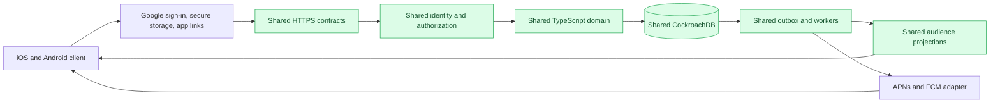
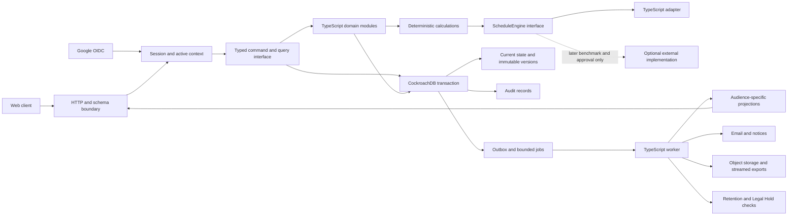

# Backend Implementation Proposal

This page records Docket's accepted backend direction and the remaining implementation decisions for its first complete Lincoln-Douglas tournament lifecycle. The project owner accepted interview decisions Q1–Q9 on 2026-09-04. Acceptance applies to the baseline below, not to every proposed library, repository detail, or unverified performance claim elsewhere on this page. It translates the requirements in [[backend-roadmap]] and the domain-model pages into a build that can be measured and verified.

## Accepted backend baseline

| Decision | Accepted requirement |
| --- | --- |
| Q1 — First release | Prove one complete tournament lifecycle, from invitations through registration, scheduling, Ballots, results, and Closure, before adding all advanced features. Mandatory integrity and authorization rules still apply to that lifecycle. |
| Q2 — Capacity | Verify 10 simultaneous tournaments, 5,000 connected users, and bursts of 200 commands per second. These are test targets, not measured capacity or permanent product limits. |
| Q3 — Operations | Use managed application hosting and omit Kubernetes initially. Q77 supersedes the managed-PostgreSQL database choice with a provisional contractually supported CockroachDB Enterprise deployment. |
| Q4 — Former budget cap | Superseded by Q72. The earlier $500 total monthly production-infrastructure cap no longer constrains the design. Cost must still be estimated, approved, monitored, and justified. |
| Q5 — Launch geography | Launch for US users. Its former single-region deployment assumption is superseded by Q72 and Q75: durability requires multiple US failure domains while production data remains in the United States. |
| Q6 — Recovery | An acknowledged tournament command must not be silently lost after a server failure. Target recovery within one hour after a major infrastructure failure. The covered failure scenarios still need explicit definition and verification. |
| Q7 — Structure | One modular TypeScript monolith, separate HTTP and worker processes, and one logical consensus database. Q77 replaces the earlier PostgreSQL engine; Q56 prohibits an initial Rust crate. |
| Q8 — Communication | JSON commands over HTTPS, live web updates, mobile push notifications, and polling fallback. The live-update transport remains to be selected. |
| Q9 — Build gates | Block merges on strict TypeScript, lint, unit tests, real-database integration tests, migration checks, contract tests, and critical lifecycle tests. Q77 requires the integration and migration gates to run against the selected CockroachDB version. Pin runtime and dependency versions, prohibit ignored type errors, and require reproducible scheduling fixtures. |
| Q10 — Hosting outage | The owner wants recovery to include an entire hosting-system outage while keeping the codebase small. Whether this means a regional outage or an entire hosting provider remains to be clarified. No particular replication design, data-loss relaxation, additional region/provider, or budget increase has been accepted. |
| Q11 — Recovery time | For an entire cloud-provider outage, recover within one hour, preferably in under fifteen minutes. This resolves Q10's provider-unavailability scope. Deployment selection, measured feasibility, recovery capacity, and cost remain open. |
| Q12 — Recovery priority | Target restoration of live tournament functions in under fifteen minutes to limit round delays and preserve user trust. Reporting and large exports may recover within the one-hour limit. Preserve acknowledged submissions. Q72 supersedes this decision's former $500 monthly cap. |
| Q13 — Automatic failover | Automatically switch to recovery when safety can be verified, with an immediate Platform Administration alert. Preserve acknowledged writes and prevent simultaneous database writers; no operator approval is needed for a verified safe switch. |
| Q14 — Tournament size | Approximately 750 competitors is the launch upper-bound planning target for a single tournament. This sizes representative load, scheduling, and recovery fixtures; it does not establish an enforced registration cutoff or measured capacity. |
| Q15 — Event mix | For representative tournament workload planning, allocate approximately 60% of Entries to speech and 40% to debate. Q16 replaces the initially equal within-category distribution with explicit event weights. This is a fixture assumption, not an enforced registration quota. |
| Q16 — Weighted event catalog | Speech: Informative Extemp and Persuasive Extemp at 20% each, with OO, Prose, Poetry, and Informative Speaking at 15% each. Debate: Congress 30%, LD 30%, CX 25%, PF 15%. |
| Q17 — Extemp name | The first extemp event is Informative Extemp. This corrects the earlier interpretive-extemp wording without changing the event weights. |
| Q18 — Cross-entry workload | A typical speech competitor enters two speech events in the test tournament. Select approximately 30% of debate Entries for cross-entry into one extemp event. Q19 confirms both members of selected CX/PF teams participate. These are fixture assumptions, not automatic participation grants or production registration caps. |
| Q19 — Team cross-entry | Both teammates of each selected CX or PF Entry enter extemp individually. Each teammate has one extemp Entry linked to that person's existing Competitor identity, while the debate Entry remains shared. |
| Q20 — Pairing response target | Target a calculated round pairing within 30 seconds per event/division, with visible progress. Benchmark the target and report failure or timeout explicitly rather than return a pairing that violates required constraints. |
| Q21 — Pairing optimization | Return the best valid candidate found within the calculation budget without requiring proof of global optimality. Every mandatory rule and locked policy still applies; optimize only preferences that policy permits. |
| Q22 — Pairing timeout retry | Show a clear timeout message with a Retry action. An authorized staff member explicitly requests a new bounded attempt; a timeout does not automatically start another search. |
| Q23 — Simultaneous maximum-size tournaments | Test all ten simultaneous tournaments at approximately 750 competitors each: 7,500 tournament participants in aggregate. Keep the separate target of 5,000 concurrently connected users and the accepted event/cross-entry workload. This is a verification requirement, not a measured support claim. |
| Q24 — Peak burst duration | Sustain 200 commands per second for 60 seconds, totaling 12,000 commands, in the initial peak-load scenario alongside Q23's tournament and connected-user workload. |
| Q25 — Ordinary request latency | During the agreed peak test, at least 95% of ordinary backend requests must finish within two seconds. Include check-in and Ballot submission through the backend response; pairing calculations and large exports keep their separate targets. |
| Q26 — Live-update delivery | Target published room, schedule, and pairing changes appearing within five seconds on connected web and mobile screens while the application is actively viewed. Background phone-notification delivery has separate expectations. |
| Q27 — Controlled failback | After automatic failover, continue serving from recovery until Platform Administration approves returning to the original hosting system. Approval follows verified health, synchronization, and a controlled switchover plan; recovery does not trigger automatic failback. |
| Q28 — Failback window | Perform planned failback only between rounds or after competition ends. Platform Administration may authorize an exception while a round is active only when the recovery system is unsafe or unavailable; the controlled checks and single-writer protections from Q27 still apply. |
| Q29 — Tail latency and reliability | During the accepted peak test, at least 99% of valid ordinary requests must finish within five seconds and fewer than 0.1% may end in an unexpected system failure. Expected authentication, authorization, validation, version-conflict, and domain-rule rejections are excluded from that failure rate and reported separately. |
| Q30 — Reconnect consistency | A reconnecting client must obtain a fresh authorized snapshot before applying further live updates. Resume deltas from the snapshot's version or cursor and reject stale or out-of-order updates. |
| Q31 — Idempotent writes | Require an idempotency key for every write. Repeating the same scoped key and canonical request returns the original result or receipt; reusing the key for different content is rejected as a conflict. Enforce the key and result atomically with the command transaction. |
| Q32 — Small background-job system | Run email, mobile push, projection, and export work through the authoritative SQL database's outbox and job tables. Q77 uses pg-boss's CockroachDB backend; do not add Redis or an external queue unless representative benchmarks show it cannot meet an accepted target. |
| Q33 — Idempotency retention | Retain idempotency keys and their original results for seven days, then remove them with a bounded cleanup job. Permanent audit records follow their separate retention rules. |
| Q34 — Job delivery | Use at-least-once job delivery with idempotent handlers and duplicate suppression. Prefer a safely repeated attempt over silently losing deferred work. |
| Q35 — Queue priorities | Keep three priority lanes in the consensus SQL job store: live projections and urgent tournament notices; routine push and email; then reports and exports. Reserve worker capacity for the live lane so lower-priority work cannot delay rounds. |
| Q36 — Job retries | Retry live projections within seconds and alert rapidly if they remain blocked; attempt push and email three times over 24 hours; attempt reports and exports three times before exposing an authorized staff Retry action. Do not retry permanent validation or authorization failures. |
| Q37 — Recovery reconnection test | Verify all 5,000 connected clients can reconnect and obtain fresh authorized snapshots over 60 seconds while the accepted 200-command-per-second burst continues. Clients use jittered backoff rather than producing one simultaneous retry spike. |
| Q38 — Idempotency scope | Scope every idempotency key by authenticated Account, Active Role Context, command name and version, and a client-generated key. The client creates one UUID for each deliberate user action and reuses it only when retrying that action. |
| Q39 — Duplicate comparison | Fingerprint the server-validated, normalized, versioned command rather than raw JSON or transport headers. Formatting differences remain equivalent, while changed business inputs under the same scoped key are rejected. |
| Q40 — Reconnect snapshot size | Limit each role-specific current-state snapshot to 512 KB compressed. Paginate history and large collections; exceeding the live snapshot limit fails the performance gate and requires projection redesign rather than an unreviewed limit increase. |
| Q41 — Live projection retry schedule | After a failed live-projection attempt, retry at approximately one, two, and five seconds, then alert operators and retain the failure for diagnosis. Polling reads authoritative state, and a missed five-second delivery remains a failed performance target. |
| Q42 — Worker lease | Claim ordinary jobs with a 30-second renewable lease and heartbeat approximately every ten seconds. Long-running exports and calculations renew leases but remain bound by their separate execution budgets; another worker may reclaim an expired lease. |
| Q43 — Peak command mix | Model the 200-command-per-second burst as 60% Ballot submissions or permitted corrections, 20% check-in or attendance changes, 10% round, room, assignment, or publication commands, and 10% registration, invitation, or other administrative writes. |
| Q44 — Urgent push handoff | Submit urgent room, schedule, and pairing notifications to APNs or FCM within 30 seconds of the authoritative commit. Measure provider acceptance separately from operating-system display, which Docket cannot guarantee. |
| Q45 — Peak read traffic | Sustain 600 ordinary reads per second for 60 seconds alongside 200 commands per second, 5,000 live connections, and competing pairing work. Q37 recovery-snapshot traffic is additional rather than included in this read rate. |
| Q46 — Live projections | Maintain small, versioned, role-specific projections in the authoritative consensus database for live schedules, rooms, Pairings, check-ins, and assignments. Use paginated SQL queries for administrative and historical views; do not introduce a second database. |
| Q47 — Ordinary request size | Limit ordinary JSON request bodies to 256 KB uncompressed and return an explicit payload-too-large result. Larger data uses a governed upload workflow rather than an enlarged general API limit. |
| Q48 — Ordinary transaction duration | Target ordinary database transactions at or below 250 milliseconds at p95 and impose a two-second execution limit. Scheduling, exports, bulk imports, and other long work run as bounded jobs outside live request transactions. |
| Q49 — Large file transfer | Transfer large uploads and downloads directly between authorized clients and object storage with short-lived signed URLs. The API authorizes intent and commits verified metadata without proxying file bytes through the TypeScript process. |
| Q50 — Runtime | Target Node.js 24 LTS using ECMAScript modules and strict TypeScript. Compile backend code with `tsc`; Node's type-stripping support does not replace repository type checking. |
| Q51 — HTTP and runtime schemas | Use Fastify 5 with TypeBox and Fastify's TypeBox type provider. Application-owned JSON Schemas provide runtime request/response validation and inferred TypeScript types. |
| Q52 — SQL access and migrations | Use stable Drizzle over `pg`, retaining SQL-like queries and checked-in generated SQL migrations. Q77 selects Drizzle's CockroachDB dialect and Cockroach-aware migrations. Review migrations before execution and prohibit automatic schema pushing in production. |
| Q53 — Foreground live transport | Use standard WebSocket connections through `@fastify/websocket` for foreground web and React Native clients. Continue to send commands over HTTPS, validate every frame through shared TypeBox contracts, and retain polling recovery. |
| Q54 — SQL job implementation | Use pg-boss with its CockroachDB backend behind an application-owned job interface for transactional enqueue, leases, heartbeats, retries, priorities, and terminal failures. Domain modules must not depend on pg-boss's private schema. |
| Q55 — Workspace tooling | Use a pnpm workspace with `apps/`, `packages/`, and `requirements/`. Do not add Nx or Turborepo unless measured build times later justify an orchestration layer. |
| Q56 — No initial Rust crate | Do not create or ship a Rust crate in the initial workspace. Implement `ScheduleEngine` in TypeScript; retain only its narrow language-independent contract so a separately approved, benchmark-justified Rust implementation remains possible later. |
| Q57 — Durable live events | Commit a sequenced `live_event` row in the authoritative transaction. Q77 supersedes PostgreSQL `NOTIFY`: API processes discover durable events through bounded polling unless a CockroachDB changefeed later passes the proof gates. |
| Q58 — WebSocket authorization | Authenticate the WebSocket upgrade with the existing Docket Session and bind subscriptions to one explicit Active Role Context. Put no credential in the URL, revalidate on session or grant change, and close revoked access immediately. |
| Q59 — WebSocket heartbeat | Send a server heartbeat approximately every 25 seconds and terminate a connection after two missed responses. Reconnection uses jittered backoff followed by snapshot-first synchronization. |
| Q60 — Slow live clients | Disconnect a client when queued WebSocket data exceeds 1 MiB or it falls more than 100 events behind. Return a retryable close reason and require a fresh bounded snapshot after reconnect. |
| Q61 — SQL pools | Begin with at most ten pooled SQL connections per API or worker process and keep the deployment-wide total below 80% of the CockroachDB connection limit. Q77 removes the dedicated PostgreSQL `LISTEN` connection because live-event wake-up uses polling initially. |
| Q62 — Migration deployment | Run migrations once using expand–migrate–contract: add backward-compatible structures, migrate data with bounded jobs, deploy compatible code, and remove old structures only in a later verified deployment. API replicas never race to migrate. |
| Q63 — Persisted-data validation | Decode persisted rows and versioned JSON with repository-owned runtime schemas before creating domain values. Drizzle query types do not replace TypeBox validation at the storage trust boundary. |
| Q64 — Live-event retention | Retain `live_event` rows for 24 hours and remove them through bounded cleanup. A client with an older cursor receives a fresh snapshot rather than a partial replay. |
| Q65 — Live cursor security | Use opaque server-issued cursors bound to the Account, Active Role Context, subscription, and snapshot version. Reject expired or cross-context cursors and do not expose raw database sequence numbers. |
| Q66 — WebSocket payload | Send small invalidation frames containing an opaque event identifier, authorized destination, change type, and projection version. Fetch the affected role-specific projection over HTTPS and deduplicate or batch rapid invalidations. |
| Q67 — Per-Account connections | Allow five active live connections per Account initially. Reject excess connections clearly; Platform Administration may temporarily raise a documented limit, but no role bypasses the protection. |
| Q68 — Per-Account request rate | Apply token buckets of ten writes per second with a burst of 20 and 30 reads per second with a burst of 60. Bulk operations use jobs, and a throttled write retains its idempotency key. |
| Q69 — Operational visibility | Emit structured JSON logs, OpenTelemetry traces and metrics, correlation IDs, outcome classes, latency percentiles, queue lag, connection counts, and recovery milestones without sensitive payloads. Retain raw service telemetry 14 days and aggregate service metrics 90 days. |
| Q70 — Backup protection | Provide at least seven days of point-in-time recovery and a daily encrypted backup stored with an independent provider for 30 days. Verify a restore monthly and run the complete provider-outage recovery drill quarterly. |
| Q71 — Unknown command outcome | If a response is lost, show “outcome unknown—checking,” query the original idempotency key, and display the stored result. If none exists, offer a retry with the same key rather than declaring failure. |
| Q72 — Durability-first resolution | Preserve zero loss of acknowledged writes and automatic safe cross-provider failover. Remove the $500 monthly cap and pursue an enterprise managed or custom consensus architecture. Keep tournament domain code small and provider-independent even when infrastructure becomes more complex. |
| Q73 — Quorum loss | Stop accepting writes whenever the database cannot prove a safe voting majority. Preserve zero-loss durability by becoming temporarily unavailable rather than risking split brain. |
| Q74 — Success boundary | Return success only after validation, authorization, and durable commit by the consensus majority across the protected failure boundary. A local write, queue insertion, or optimistic client state is not success. |
| Q75 — US data jurisdiction | Keep production voting replicas, witnesses, backups, service telemetry, and object-storage copies in US regions initially. Cross-provider protection does not authorize international data transfer. |
| Q76 — Read consistency | Require strongly consistent reads for live tournament state, authorization, command receipts, and administrative decisions. Allow stale follower reads only for explicitly immutable public archives that identify their version. |
| Q77 — Provisional consensus engine | Use CockroachDB Enterprise provisionally, first seeking a vendor-managed or BYOC contract for one cluster across three US cloud providers with RPO 0 and automatic minority-safe recovery. If unavailable, use self-hosted Enterprise with vendor support; YugabyteDB Anywhere is the fallback. Production acceptance still requires the contract and proof gates. |
| Q78 — Provider topology | Begin the proof of concept with AWS `us-east-1`, Azure `East US`, and Google Cloud `us-east4`, placing three CockroachDB nodes in each provider and spreading them across availability zones where possible. Treat those regions as candidates until round-trip latency and correlated-risk testing approve the final US placement. |
| Q79 — Database survival policy | Configure each provider site as a CockroachDB region with `SURVIVE REGION FAILURE`. Use five voting replicas per range in a 2+2+1 provider distribution so no provider owns a majority and losing either two-replica provider leaves a three-of-five quorum. Production acceptance requires proof for loss and isolation of every provider. |
| Q80 — Transaction retry bound | Retry the complete CockroachDB transaction for SQLSTATE `40001` up to five total attempts with short jittered exponential backoff, all within the accepted two-second ordinary execution limit. On exhaustion return an explicit retryable conflict or availability outcome tied to the original idempotency key. Never perform external side effects inside the retry loop. |
| Q81 — Live-event polling | Each API process polls sequenced `live_event` rows every 500 milliseconds while it has live subscribers and stops when it has none. A newly connected or reconnected client follows the accepted snapshot-first synchronization path before receiving invalidations. The proof must include the polling query budget and five-second foreground-delivery target. |
| Q82 — Application capacity | Run at least two TypeScript API instances and one worker in each of the three providers. Size and test the deployment so any surviving two providers can carry the complete accepted tournament workload after one provider is lost; keep provider-specific behavior outside the domain modules. |
| Q83 — Quorum-loss experience | When no safe database majority can be proven, show a prominent service-outage state and reject live reads and writes as temporarily unavailable. Only immutable, version-labelled public archives may remain accessible; never present potentially stale tournament state as current. |
| Q84 — Unsubmitted form data | Retain only non-sensitive form input in the currently running screen's memory, visibly mark it not submitted, never send it automatically, and discard it when the client closes or restarts. After service recovery, a deliberate retry of an attempted command uses its original idempotency key. |
| Q85 — Incident authority | Immediately page a primary and backup Platform Operations responder. Tournament Administrators receive plain-language status updates but cannot perform database failover, failback, or infrastructure changes. Attribute every privileged recovery action and record its evidence and outcome. |
| Q86 — Deployment order | Deploy one provider at a time, beginning with a small canary. Require backward-compatible database changes and automated health and latency gates; pause or roll back application code on failure. Never automatically roll back a database schema, and retain expand–migrate–contract. |
| Q87 — Failure workload shedding | After losing a provider, preserve live authorization, tournament commands, schedules, Pairings, rooms, check-in, Judge assignments, Ballots, advancement-critical calculations and publication, and urgent notices. Pause reports, exports, routine email, and other low-priority jobs while preserving their durable queue state. |
| Q88 — Edge-outage scope | The automatic failover promise covers loss of any one AWS, Azure, or Google Cloud application/database provider, not complete failure of the shared global edge. Use independent diagnostic and recovery access plus a documented edge-failure runbook; do not add automatic dual-edge coordination initially. |
| Q89 — Stateless WebSocket recovery | Use no API or provider session affinity. After an instance, provider, or edge disconnect, reconnect with jitter, authenticate again, obtain a fresh authorized snapshot, and resume through the durable event cursor. Never assume an existing WebSocket can move between servers. |
| Q90 — Routing readiness | Remove a provider API pool from public routing when `/readyz` cannot prove the local API can authenticate, reach a strong CockroachDB endpoint, and serve bounded live traffic. Keep `/healthz` as a shallow diagnostic process check and expose no secrets or internal failure detail from either endpoint. |
| Q91 — Object classification | Keep schedules, Pairings, Ballots, permissions, results, and other authoritative tournament state in CockroachDB. Treat generated PDFs, CSV files, and exports as regenerable. Original evidence uploads and other non-reconstructable files are irreplaceable objects requiring synchronous cross-provider protection before acknowledgement. |
| Q92 — Global edge | Use Cloudflare Enterprise Load Balancing as the primary edge. Give AWS, Azure, and Google Cloud separate origin pools pointing to each provider's local load balancer, route with `/readyz`, manage configuration as infrastructure code, and retain Q88's independently reachable diagnostic and recovery access. |
| Q93 — Irreplaceable object durability | Write every irreplaceable object synchronously to US-hosted Amazon S3 and Google Cloud Storage and mark its manifest ready only after both copies succeed. If either store is unavailable, pause new irreplaceable uploads while the rest of Docket continues; do not add a third adapter or 2-of-3 object quorum initially. |
| Q94 — Regenerable artifacts | Store generated PDFs, CSV files, and exports in one US bucket rather than synchronously duplicating them. If missing or unavailable, regenerate them from versioned CockroachDB state within the accepted reporting/export recovery tier. |
| Q95 — Edge health cadence | Run Cloudflare Enterprise health checks every ten seconds from multiple locations. Require consecutive failures before removing a provider pool, prove the exact threshold under packet-loss tests, and immediately page Platform Operations when a pool is removed. |
| Q96 — Object identity and integrity | Assign every irreplaceable object an opaque server-generated UUID and immutable provider objects. Privately record SHA-256, byte length, validated media type, and both provider version identifiers in its CockroachDB manifest; derive no storage key from filenames, Account data, or the checksum. |
| Q97 — Dual-storage upload workflow | Upload the file once directly to S3 through a short-lived signed URL, then use durable transfer orchestration to copy and verify it in Google Cloud Storage. Display `Protecting` until both copies verify and commit `Ready`; failures remain explicitly retryable and pending, never acknowledged as safely stored. Q123 later selects the managed transfer mechanism. |
| Q98 — Object encryption | Initially use independent provider-managed encryption: SSE-S3 for the AWS copy and Google-managed encryption for the GCS copy. Add no application cryptography or external key manager; adopt independent provider-local customer-managed keys only after a concrete compliance requirement. |
| Q99 — No-overwrite transfer checks | Require create-only writes with provider preconditions, validate provider-computed transfer checksums, and independently verify Docket's private SHA-256 before `Ready`. A retry must never overwrite an existing immutable object. |
| Q100 — Protected-object deletion | After an applicable retention or authorized deletion becomes due and no Legal Hold applies, commit a durable tombstone that immediately denies access. Idempotent workers delete every version from both stores, verify completion within 24 hours, alert on residue, and retain only the permitted payload-free deletion audit. |
| Q101 — Copy repair and audit | Compare manifests with both stores daily and perform a monthly sampled full-read checksum verification. Immediately alert when a `Ready` object has fewer than two valid copies, serve only a verified survivor, and repair the missing copy idempotently when its provider is available. |
| Q102 — Initial evidence limits | Accept only PDF, JPEG, and PNG irreplaceable uploads, capped at 25 MB per object. Reject archives, executables, video, and audio until an explicit use case and additional security and load tests justify them. |
| Q103 — Signed URL lifetime | Use 15-minute upload and download URLs limited to one opaque object key and required operation. Refresh only after current authorization and never retain complete signed URLs in logs, analytics, notifications, or database records. |
| Q104 — Protection completion target | Under normal conditions, target `Ready` within two minutes at p95 after the S3 upload completes. Alert when `Protecting` exceeds ten minutes and continue reporting its truthful pending state. |
| Q105 — Abandoned upload cleanup | Allow an incomplete `Protecting` upload to retry for 24 hours. If it still cannot complete and no Legal Hold applies, tombstone the manifest, delete every partial provider copy, require a new upload, and tell the user to retain the original until `Ready`. |
| Q106 — Protected download failover | Authorize every download through the API, select a currently verified provider copy, and return a short-lived signed URL. Prefer S3 and use GCS when the S3 copy is unavailable; expose no provider choice or provider-specific workflow to the user. |
| Q107 — Application hosting products | Run the API on AWS ECS Fargate behind an ALB, Azure Container Apps, and Google Cloud Run Service. Run separate workers as an ECS Fargate service, ingress-disabled Azure Container App, and Cloud Run Worker Pool. Keep Azure provisional until a multi-hour test resolves its documented request-timeout ambiguity. |
| Q108 — Malware scanning | Upload only to a private S3 quarantine prefix protected by GuardDuty Malware Protection for S3. Proceed only after `NO_THREATS_FOUND` for the exact S3 version plus Docket size, checksum, and file-signature verification; every threat, unsupported, access, scanner, or timeout outcome remains quarantined and inaccessible. |
| Q109 — Safe file delivery | Never render an original evidence upload inline. Deliver PDFs and original images as attachments with server-controlled media types and `X-Content-Type-Options: nosniff`. For inline images, decode and re-encode a separate sandboxed JPEG/PNG derivative; defer inline PDF previews. |
| Q110 — API replica floor | Run three warm API instances in each provider, distributed across available failure zones, plus the accepted worker in each provider. The surviving six API instances must pass the full 5,000-connection and request-load fixture; raise the counts when measurements require it. |
| Q111 — One immutable build | CI builds one OCI image, creates its SBOM, scans and signs it, and copies the exact digest to ECR, Azure Container Registry, and Artifact Registry. API and worker use the same image with different entry commands, and deployments reference no mutable tag. |
| Q112 — WebSocket connection lifetime | Gracefully rotate every live connection at a random point between 50 and 55 minutes across every provider. The client reconnects with jitter, authenticates again, obtains a current authorized snapshot, and resumes through its durable cursor. |
| Q113 — Active workers in every provider | Keep one active worker in each provider and let all three claim CockroachDB/pg-boss jobs through leases. Require idempotent handlers and no singleton application leader; exercise a new worker revision with synthetic canary jobs before provider-by-provider production rollout. |
| Q114 — Upload state machine | Use the closed durable union `AwaitingUpload`, `PendingScan`, `Protecting`, `Ready`, `Rejected`, and `Deleted`, with retry and failure detail stored separately. GuardDuty events match the exact current S3 version and transition idempotently; duplicate or stale events do nothing. |
| Q115 — Delayed scan handling | Alert when `PendingScan` exceeds ten minutes and request at most one exact-version on-demand rescan. Keep the object quarantined for up to 24 hours; if no clean result arrives, record the truthful reason `CouldNotBeScanned`, move it to `Rejected`, clean it up through the governed deletion path, and permit a new upload. A timeout is never clean. |
| Q116 — Confirmed-malware cleanup | On `THREATS_FOUND`, move the manifest to `Rejected`, immediately deny access, never create the GCS copy, notify the uploader without sensitive detection detail, and page Platform Security. Keep malicious bytes in inaccessible quarantine for no more than 24 hours for authorized automated confirmation unless an exact Legal Hold applies, then delete them and retain only permitted metadata-only security audit. |
| Q117 — Cross-cloud database network | Initially connect each provider to CockroachDB through its encrypted public SQL endpoint using fixed outbound addresses, narrow allowlists, least-privilege credentials, certificate rotation, and provider-loss tests. Do not build a three-cloud private VPN mesh unless the enterprise contract or proof of concept demonstrates that it is necessary. |
| Q118 — Sandboxed image derivatives | Generate inline JPEG/PNG derivatives in an isolated, no-egress worker with configurable hard bounds on dimensions, memory, CPU time, and temporary storage. Decode and re-encode into a fixed safe format, strip metadata, and fail closed; derivative failure removes only the preview and never changes the verified attachment-only original. |
| Q119 — Keyless cloud workload identity | Give every API and worker a separate least-privilege native identity: ECS task roles, Azure managed identities, and attached Cloud Run service accounts. CI federates through OIDC independently into all three clouds. Store no long-lived AWS, Azure, or Google Cloud access key in an image, repository, CI variable, or vault. |
| Q120 — Database credential isolation and rotation | Create separate CockroachDB SQL users for `aws_api`, `aws_worker`, `azure_api`, `azure_worker`, `gcp_api`, and `gcp_worker`, storing each secret only in its provider's native vault. Rotate with an overlapping successor user, roll and verify one provider and process at a time, drain old pools, and then revoke the predecessor. |
| Q121 — Cloudflare automation credential | Keep one account-owned Cloudflare API token only in the infrastructure pipeline, scoped to the exact account, zone, Load Balancing, and DNS actions it needs. Application workloads and routine releases cannot access it. Rotate by creating and verifying a distinct successor token before revoking the predecessor. |
| Q122 — US-only production-data boundary | Apply US-only controls to application records, object copies, secrets, backups, logs, metrics, traces, and TLS decryption. Use Cloudflare Enterprise US Regional Services and the US Customer Metadata Boundary; permit vendor control-plane metadata and support access only under reviewed contractual restrictions. |
| Q123 — Managed secondary-object transfer | After GuardDuty approves the exact S3 version, use agentless Google Storage Transfer Service to copy the object to GCS. Docket correlates and verifies the destination generation, length, and checksum and withholds `Ready` until both copies pass. The proof of concept must meet the two-minute p95 target; direct workload-identity transfer is the fallback if it does not. |
| Q124 — Upload behavior during AWS loss | Route upload initialization to the AWS API pool because S3 and GuardDuty are the sole initial ingress. During AWS loss, disable only new irreplaceable uploads with a truthful temporary-unavailability message; continue schedules, Ballots, Pairings, and other live functions through surviving providers, and tell users to retain and retry their source file. |
| Q125 — Versioned secret loading | Resolve one specifically versioned CockroachDB credential when each container starts. Rotate through successor-first provider-by-provider rolling deployment rather than mid-connection hot reload. Distribute the public CockroachDB CA as a versioned trust bundle and require full TLS hostname verification. |
| Q126 — Cloudflare break-glass access | Keep no permanent spare token. Two named Platform Administrators hold hardware-protected Cloudflare access; two-person approval may create a short-lived emergency token whose actions are recorded and which is revoked immediately after use. |
| Q127 — US-residency enforcement | Encode an allowlist of approved US locations in infrastructure policy and block noncompliant deployments. Inventory databases, buckets, vaults, registries, backups, and telemetry destinations daily, alert immediately on drift, and review vendor residency terms quarterly. |

Capacity, durability, recovery, and operating cost must be demonstrated together on the proposed deployment. There is no longer a fixed monthly cap, but no load tests, restore drills, provider quote, or executable backend currently substantiate the targets. Cost and complexity remain decision inputs and must not silently weaken durability or recovery.

Q15 allocation uses Entry count: for E total Entries, assign approximately 0.60E to speech and 0.40E to debate, then apply Q16's weights below within each category. Use integer allocations with a deterministic remainder so category totals and the overall total are preserved. If E were 750, category totals would be 450 and 300; Q14 specified 750 Competitors, so this example is not yet the actual Entry fixture. Cross-entry and team membership affect the relationship between people and Entries. The category mix also does not specify division sizes. The first Lincoln-Douglas lifecycle fixture remains distinct from a later mixed-event load fixture.

The mixed-event workload catalog below was supplied in Q16, superseding the earlier catalog gap. Lincoln-Douglas remains the first end-to-end implementation slice in [[backend-roadmap]]. [[registration-model]] distinguishes Competitors from Entries and permits governed cross-entry. These weights describe representative load; they do not settle event rules or force actual tournament registrations into these proportions.

| Category | Event | Share within category | Share of all Entries |
| --- | --- | --- | --- |
| Speech | OO | 15% | 9% |
| Speech | Prose | 15% | 9% |
| Speech | Poetry | 15% | 9% |
| Speech | Informative Extemp | 20% | 12% |
| Speech | Persuasive Extemp | 20% | 12% |
| Speech | Informative Speaking | 15% | 9% |
| Debate | Congress | 30% | 12% |
| Debate | LD | 30% | 12% |
| Debate | CX | 25% | 10% |
| Debate | PF | 15% | 6% |

Each category's internal weights sum to 100%; the combined weights sum to 100% of Entries. Q17 resolves the first extemp name as Informative Extemp, distinct from Informative Speaking.

Q18 links the same Competitor to multiple Entries rather than duplicating identity records. Model two distinct speech events for the typical speech competitor and one of Informative Extemp or Persuasive Extemp for cross-entering debate participants. The 30% selection denominator is debate Entries as stated by the owner. Under Q19, each selected CX/PF team contributes two individual extemp Entries, while each selected individual debate Entry contributes one. Selection is counted once per debate Entry, not once per teammate. The distribution of those selected participants between the two extemp events also remains to be set.

Include debate participants' extemp Entries within the accepted speech event totals when constructing the fixture, preserving the existing 60%/40% Entry mix rather than adding them after allocation. This is the current fixture interpretation, not a change in the stated weights. The two-speech-event assumption applies to typical speech competitors; debate cross-entry adds one extemp event for each participating debate Competitor. The fixture must satisfy approximately 750 unique Competitors and the Entry weights together, accounting for two-person CX/PF teams and both teammates' cross-entry. Validate each teammate's schedule separately; shared debate participation does not merge their individual extemp assignments.

Use the existing [[registration-model]] cross-entry authorization and schedule-compatibility rules. Test that ordinary unapproved overlaps are rejected and that approved cross-entry holds obey their limits across schedule revisions, pairing publication, and recovery. The workload percentage grants no exemption from these rules.

Q12 recovery planning prioritizes the live command path and its dependencies. The proposed verification scope includes sessions and authorization, current schedules and Pairings, rooms, check-in, Judge assignments, Ballot submission, and the calculations and publication needed to advance rounds. Only nonessential reporting and large exports are deferred; required security and data-integrity checks remain operative. The final acceptance fixture must exercise the complete path at the agreed recovery load. Routine process crashes should recover faster where possible; the disaster target is not a delay to wait before restarting.

Hosting-outage protection preserves the same TypeScript domain implementation while Q77 replaces single-primary PostgreSQL with one logical CockroachDB Enterprise cluster across providers. Keep Raft replication, quorum, and automatic leadership in the database infrastructure; application responsibilities include connection recovery, bounded whole-transaction retries, duplicate-command protection, and durable jobs. See [[backend-disaster-recovery]] for sourced tradeoffs and mandatory proof. Voting replicas must span the protected provider failures, and asynchronous backup copies do not satisfy the accepted zero-loss live-write promise.

Q27 separates failover from failback. Automatic failover may restore live operations when its safety checks pass, but recovery remains the active writer until Platform Administration approves a verified return. Approval must identify the intended target, current database lineage, synchronization evidence, health checks, expected interruption, rollback plan, and responsible administrator. The infrastructure adapter performs the controlled switch and records the outcome; tournament domain modules do not contain provider-specific failback logic.

Q28 restricts ordinary failback to a natural operating boundary: between rounds or after competition. An active-round exception is reserved for a recovery system that has become unsafe or unavailable and requires an attributed Platform Administration decision; it does not bypass synchronization, fencing, health, or rollback checks. This keeps failback machinery out of tournament rules while preventing a planned infrastructure move from disrupting live Ballot and check-in work.

## Interview design tree

The documentation-backed grilling interview is defining the backend before implementation. Settled branches and their next dependent decisions are:

- Complete first lifecycle → exact release requirement ledger and representative tournament fixtures.
- Capacity target, approximately 750 competitors per tournament, a 60-second burst of 200 commands and 600 reads per second, a concurrent 5,000-client recovery reconnection wave, two-second ordinary-request p95, five-second p99, and a below-0.1% unexpected-failure rate → division distribution, remaining cross-entry details, and steady-state connected-user behavior.
- Managed hosting preference, US-only production data, and durability-first provider independence without a fixed budget cap → enterprise or custom consensus comparison, concrete US failure-domain placement, resource sizing, and cost approval.
- Zero-loss majority-committed writes and automatic cross-provider recovery → enterprise or custom consensus topology, quorum behavior, minority exclusion, backup restoration, and evidence from recovery drills.
- Modular TypeScript and CockroachDB-backed jobs with priority lanes, at-least-once delivery, and bounded retries → Cockroach compatibility proof, module interfaces, queue lease details, and benchmark evidence before adding another broker.
- Shared HTTPS contracts, snapshot-first reconnects, and a five-second foreground live-update target → transport, cursor/version contract, mobile contract compatibility, and background notification expectations.
- Required merge gates → executable checks, requirement coverage, and controlled performance baselines.

Implementation remains a later stage of the interview; accepted recommendations here authorize documenting the design, not provisioning paid infrastructure.

## Accepted architecture shape

Begin with a modular TypeScript monolith compiled with `tsc` for pinned Node.js 24 LTS in ECMAScript-module mode. Run the Fastify HTTP application and worker as separate processes from the same pnpm workspace and release. Q77 provisionally selects CockroachDB Enterprise as the one logical authoritative state, projection, event, idempotency, and initial job store. Use Drizzle's CockroachDB dialect over `pg` and configure pg-boss for its CockroachDB backend. Object storage holds generated exports and restricted large payloads. All voting database state, witnesses, backups, service telemetry, and object copies remain in US regions.

Procurement first requests a vendor-managed or BYOC CockroachDB Enterprise contract for one cluster across three cloud providers. The proof-of-concept starting placement is AWS `us-east-1`, Azure `East US`, and Google Cloud `us-east4`, with three database nodes per provider distributed across availability zones where possible. The final US regions require round-trip latency and correlated-risk approval. Each provider site is a CockroachDB region using `SURVIVE REGION FAILURE`; five voting replicas per range use a 2+2+1 provider distribution so no provider controls a majority. The agreement must explicitly cover RPO 0 after complete loss of any one provider, automatic minority-safe leadership, supported US placement, recovery targets, version compatibility, upgrades, backups, and responsibility boundaries. If Cockroach Labs will not contract that topology, the fallback is self-hosted CockroachDB Enterprise with vendor support and professional services; YugabyteDB Anywhere becomes the alternate engine only through another explicit decision.

Deploy the same release to all three providers with three warm TypeScript API instances and one active worker in each. Distribute the API instances across available provider failure zones. The capacity fixture must prove that the six APIs surviving loss of any provider can carry 5,000 live connections and the full accepted request workload; measurements may raise but never silently lower the floor. Provider adapters may select local endpoints, networking, secrets, and telemetry destinations, but tournament domain modules remain provider-independent.

Use AWS ECS Services on Fargate behind an Application Load Balancer for the AWS API and a separate no-load-balancer ECS worker service. Use Azure Container Apps for the Azure API and a separate ingress-disabled continuously running worker app. Use a Google Cloud Run Service for the GCP API and a Cloud Run Worker Pool for its continuously running worker. The Azure selection remains provisional until a multi-hour WebSocket test and vendor clarification resolve whether its documented 240-second request-timeout wording applies to upgraded connections. Cloud Run's documented 60-minute WebSocket maximum is accepted only with the connection-renewal behavior selected later.

CI produces one OCI image for both process roles, generates its software bill of materials, scans and signs it, and copies that exact immutable digest into ECR, Azure Container Registry, and Artifact Registry. Provider deployments choose the API or worker entry command but never rebuild the image or reference a mutable tag. All three workers remain active and compete for CockroachDB/pg-boss leases without a singleton application leader; handlers remain idempotent. A new worker revision must first complete synthetic canary jobs before it can claim production work, then rolls one provider at a time.

Deploy a new application release to one provider at a time, starting with a small canary and advancing only after automated health and latency gates pass. A failed gate pauses the rollout or rolls back application code. Database evolution remains backward-compatible and follows expand–migrate–contract; schema rollback is never automatic. During a provider failure, workers preserve live projections, urgent tournament notices, and advancement-critical calculations while pausing routine email, reports, exports, and other low-priority jobs without discarding their durable queue state.

A provider or quorum incident immediately pages both the primary and backup Platform Operations responders. Tournament Administrators receive plain-language operational status but no infrastructure control. Every privileged recovery operation records its actor, evidence, target, and outcome.

The automatic failover boundary covers loss of one AWS, Azure, or Google Cloud application/database provider. Use Cloudflare Enterprise Load Balancing as the primary shared global edge, with one origin pool pointing to each provider's local load balancer. Manage the edge configuration as reviewed infrastructure code and route pools using `/readyz`. Run Enterprise checks every ten seconds from multiple locations and require consecutive failures before pool removal; packet-loss tests determine the final threshold. Pool removal pages Platform Operations immediately. Cloudflare remains a documented common dependency: retain independently reachable diagnostic and recovery access plus an edge-failure runbook, but do not build automatic coordination between two edge networks initially. Public routing removes a provider pool when its `/readyz` endpoint cannot prove that the local API can authenticate, reach a strongly consistent CockroachDB endpoint, and serve bounded live traffic. `/healthz` reports only shallow process liveness for diagnostics; neither endpoint reveals secrets or internal failure detail.

Live commands and reads use the consensus leader or another endpoint that proves strong consistency. A successful command receipt follows validation, authorization, and durable majority commit across the protected failure boundary. If quorum is unavailable, Docket rejects live reads and writes as temporarily unavailable and presents a prominent service-outage state rather than potentially stale tournament information. Lagging follower reads are limited to immutable, version-identified public archives; they cannot serve live schedules, assignments, authorization, receipts, or administrative decisions.

Keep scheduling behind a narrow, versioned, runtime-validated `ScheduleEngine` interface and ship only the TypeScript implementation initially. Do not scaffold a Rust crate. A later Rust implementation requires representative evidence that TypeScript cannot meet an accepted resource budget plus a new explicit approval; it must consume and return the same contract and pass the same golden fixtures.

Fastify routes use application-owned TypeBox schemas for both runtime boundaries and inferred TypeScript handler types. Standard WebSocket connections use `@fastify/websocket`, authenticate through the existing Docket Session, bind each subscription to one Active Role Context, and validate every application frame explicitly because upgraded messages do not pass through ordinary HTTP response serialization. Credentials never appear in the WebSocket URL. Session and grant changes trigger subscription revalidation and immediate closure when access ends. HTTPS remains the command transport; WebSocket messages announce versioned live changes, and polling remains the fallback. Use no API-instance or provider session affinity. Gracefully rotate each connection at a randomized point between 50 and 55 minutes in every provider. Every planned or unplanned disconnect uses jittered reconnection, fresh authentication, an authorized snapshot, and durable-cursor recovery rather than attempting to transfer socket state between servers.

Every authoritative change that needs live delivery appends a sequenced `live_event` row in the same CockroachDB transaction. Each API process polls new rows every 500 milliseconds while it has live subscribers and stops polling when it has none; a new or reconnecting subscriber completes snapshot-first synchronization before receiving invalidations. PostgreSQL `NOTIFY` is not part of the selected design. A CockroachDB changefeed may replace polling only after authorization, ordering, recovery, operational, and load proof. Rows expire after 24 hours through bounded cleanup. Clients receive opaque cursors bound to Account, Active Role Context, subscription, and snapshot version rather than raw database positions; an expired or mismatched cursor requires a fresh snapshot. Connections receive server heartbeats approximately every 25 seconds and close after two missed responses. A connection also closes with a retryable reason when its queued data exceeds 1 MiB or it falls more than 100 events behind. All those closures re-enter the snapshot-first synchronization path with jittered backoff.

WebSocket frames are small invalidations, not full sensitive projections. A frame identifies the opaque event, authorized destination, change type, and new projection version; the client deduplicates or batches rapid invalidations and fetches the affected role-specific projection over HTTPS. Each Account may hold five live connections by default. A temporary Platform Administration increase is attributed and expires; there is no unlimited role bypass.

Stable Drizzle CockroachDB schema declarations and SQL-like queries sit over bounded `pg` pools. Start with at most ten pooled connections per API or worker process; polling uses the ordinary bounded pool and there is no dedicated `LISTEN` connection. The deployment calculation keeps the total below 80% of the contracted CockroachDB connection limit. Generated Cockroach-aware SQL migrations are checked into Git and reviewed. One deployment migration runner follows expand–migrate–contract rather than allowing API replicas to race or derive and push a production schema. pg-boss uses `backend: "cockroachdb"` behind a Docket-owned job interface so job semantics remain part of the application contract without leaking library tables into domain modules.

## Web and mobile clients

Adding downloadable iOS and Android applications does not require a second domain backend. The web client and mobile client should call the same versioned HTTPS command and query interface and receive the same audience-specific projections. The CockroachDB model, authorization rules, domain modules, audit records, workers, retention, and TypeScript scheduling contract remain shared.

The clients need different adapters around that shared interface. The web client uses browser navigation, an HTTP-only secure session cookie, and web notification behavior. The mobile client is one React Native and Expo TypeScript codebase for iOS and Android, built with Expo development builds rather than Expo Go. It uses the platform Google sign-in flow with Authorization Code and PKCE where applicable, operating-system secure credential storage, universal or app links, and APNs or FCM push delivery. The backend accepts separate registered client audiences but maps the verified Google issuer and subject to the same Docket Account.

The web and mobile interfaces remain separate applications. They share versioned contracts, runtime schemas, the HTTPS client, terminology, and design tokens without forcing desktop and touch layouts through one visual component tree. Expo-supported libraries are preferred for platform functions, with focused Swift or Kotlin modules permitted when a measured need or platform requirement justifies them.

The mobile application serves every Docket actor, including Competitors, Coaches, Judges, Tournament Directors, Tabulation Staff, School Managers, Platform Administrators, and Legal and Privacy Operations personnel. Authentication identifies the Account; current Docket grants determine the available roles and scopes. A user with multiple grants explicitly switches among them through the application UI, with exactly one Active Role Context governing a workspace at a time rather than a combined multi-role workspace. The selected context determines commands, projections, navigation, and required session policy. The client does not infer authority from its installation, device, email domain, or visible navigation.

Each request carries the selected context identifier and the backend revalidates that context against current grants. Switching context must replace role-specific navigation and clear context-scoped client data. The existing unsaved-work guard applies before switching so an unfinished action cannot be silently transferred into another role.

Role creation follows explicit authority paths. A School Manager may invite Coaches and student Competitors only into that Manager's School. Platform Administration staff temporarily grant the single Tournament Administrator authority for a tournament. That authority is the user-facing name for the existing Tournament Owner role, includes Tournament Director capabilities, and may appoint additional Directors and Tabulation Staff. It begins at an attributed effective time, ends automatically in the Tournament Closure transaction, and may be revoked or replaced earlier only by Platform Administration. Authorization fails immediately after the assignment ends, while historical actions keep their original actor attribution. These operations use the same audited, transactionally validated Access Offer and grant mechanisms on web and mobile; neither client may infer a role from an email domain or local state.

Administrative mobile workflows must expose the same validation, approval, publication, recovery, warning, and audit semantics as the web interface. Responsive presentation may differ, but mobile cannot offer a weakened command or bypass merely because screen space is constrained.

Mobile feature delivery is phased while the backend command and projection contracts remain shared. The first mobile release covers role switching, invitations and participation, schedules, Pairings, check-in, Judge assignments, Ballot submission, notices, results, and the urgent approvals or corrections needed during a live tournament. Later mobile releases add complex tournament setup, policy and schedule configuration, bulk roster administration, reporting, exports, platform support, identity review, retention governance, and Legal Hold interfaces. A temporarily web-only interface does not create a web-only domain command or different authorization rule.

The mobile application requires an active internet connection for Docket functionality. It does not support offline Ballot drafting, queued commands, offline schedule access, or later synchronization. A command succeeds only after the server validates and commits it and returns a receipt. Mobile storage is limited to secure session material and transient presentation state; sensitive state must be removed on logout, authority loss, or context switch according to the applicable policy.

During a service interruption, a running web or mobile screen may retain non-sensitive form fields only in memory and must label them as not submitted. It does not persist or automatically transmit them, and closing or restarting the client discards them. If a command attempt received no conclusive result, a user-initiated retry after recovery retains that attempt's idempotency key; input that was never submitted receives a new key only when the user deliberately submits it.

Mobile push notifications display useful tournament logistics directly in the notification: tournament identity, round, scheduled start time, room, and competitor names. The backend creates the notification only for an authorized recipient and labels it with the applicable role and tournament context. The payload includes a stable destination identifier so opening it can fetch current server state rather than trusting possibly stale notification text. Ballot contents, scores before authorized release, credentials, contact information, and private administrative details are excluded. The application respects operating-system notification-preview settings. For urgent room, schedule, and pairing changes, Q44 measures authoritative commit through accepted submission to APNs or FCM and targets 30 seconds; phone connectivity, operating-system policy, and the eventual display time are reported separately rather than presented as a Docket guarantee.

### Web path


### iOS and Android path





The write path is deliberately short: validate, authenticate, authorize, claim the scope-bound idempotency key, execute one domain transition, and commit the result or receipt, state version, audit record, and outbox entries in one database transaction. The scope combines authenticated Account, Active Role Context, command name and version, and the client UUID created for one deliberate action. A duplicate whose normalized, validated command fingerprint matches returns the stored result; the same scoped key with changed business input is a conflict. Success waits for protected consensus commit; loss of quorum fails closed. Ordinary transactions target 250 milliseconds at p95 and stop at a two-second execution limit. External delivery, large calculations, bulk imports, and exports run outside request transactions through bounded jobs. Protected live reads use strongly consistent, small, versioned role-specific projections; administrative and historical reads use bounded pagination, with stale reads allowed only for immutable version-labelled public archives.

Ordinary JSON requests are limited to 256 KB uncompressed. Large files do not pass through API-process memory: an authorized command creates a short-lived, narrowly scoped signed object-storage transfer, and a later command verifies and commits its metadata. Download authorization follows the same audience and retention rules as the underlying artifact; possession of a stale URL must not become durable access.

CockroachDB remains authoritative for schedules, Pairings, Ballots, permissions, results, and other live tournament state. PDFs, CSV files, and exports generated entirely from versioned database state are regenerable artifacts rather than zero-loss source data; store them in one US bucket and regenerate them within the accepted reporting/export recovery tier if the object or its provider is unavailable. Original evidence uploads and any other non-reconstructable files are irreplaceable objects. Give each an opaque server UUID and immutable provider keys that reveal no filename, Account data, or checksum. Its private CockroachDB manifest records SHA-256, byte length, validated media type, and the S3 version and GCS generation identifiers.

The client requests upload initialization through the AWS API pool and uploads an irreplaceable object once, directly to a private S3 quarantine prefix through a 15-minute signed URL bound to one opaque key and the upload operation. Its closed durable state is `AwaitingUpload`, `PendingScan`, `Protecting`, `Ready`, `Rejected`, or `Deleted`; retry counts and typed failure detail remain separate attributes rather than new states. GuardDuty Malware Protection for S3 scans the exact immutable S3 version. A result must match the manifest's current version and state, and duplicate or stale delivery changes nothing. Only `NO_THREATS_FOUND` plus Docket verification of length, checksums, and actual PDF/JPEG/PNG signature advances toward `Protecting`. Alert when `PendingScan` exceeds ten minutes and request at most one exact-version on-demand rescan. The file remains inaccessible for up to 24 hours; if no clean result arrives, record `CouldNotBeScanned`, move it to `Rejected`, clean it up through the governed deletion path, and allow the user to upload again. A timeout or any other unresolved result is never clean. On `THREATS_FOUND`, move the manifest to `Rejected`, immediately deny access, never create the GCS copy, notify the uploader without sensitive detection detail, and page Platform Security. Keep malicious bytes in inaccessible quarantine for no more than 24 hours for authorized automated confirmation unless an exact Legal Hold applies, then delete them and retain only the permitted metadata-only security audit. After a clean result, agentless Google Storage Transfer Service copies the exact S3 version to US-hosted Google Cloud Storage. A Docket reconciler correlates and verifies the GCS generation, length, and checksum against the manifest and commits `Ready` only after both copies pass. The proof of concept must meet the two-minute p95 target; otherwise direct ECS-to-GCS transfer through workload identity is the accepted fallback. A failed or interrupted copy stays visibly pending and retryable and is never reported as safely stored. If it still cannot complete after 24 hours and no Legal Hold applies, transition through the accepted deletion workflow, delete all partial copies, and require a new upload. During AWS loss, disable only new irreplaceable uploads with a truthful temporary-unavailability message while unrelated Docket functions continue through surviving providers. The client tells the user to retain the source file until `Ready`. Do not add a third storage adapter or 2-of-3 object quorum initially.

Use SSE-S3 and Google-managed GCS encryption independently, without application-level cryptography or an external key service. A future concrete compliance requirement may justify separate provider-local customer-managed keys, but neither stored copy may depend exclusively on the other provider's key service. Provider writes use create-only preconditions and transfer checksums; the worker also verifies the private SHA-256 before `Ready`. The initial irreplaceable-upload allowlist is PDF, JPEG, and PNG with a 25 MB per-object limit. Archives, executables, video, and audio are rejected.

When deletion becomes due and no exact Legal Hold applies, a CockroachDB tombstone immediately denies further access. Idempotent workers remove every object version from both providers, verify completion within 24 hours, alert on any residue, and retain only the permitted payload-free deletion audit. A daily manifest-to-storage inventory comparison detects missing copies, and a monthly sample performs a complete read and checksum verification. A `Ready` object with fewer than two valid copies alerts immediately, serves only a verified survivor where policy permits, and is repaired idempotently when the unavailable provider returns.

Every protected download reauthorizes through the API, selects a currently verified copy, and returns a 15-minute signed URL for only that object and read operation. Prefer S3 and fall back to GCS without exposing provider choice to the user. Upload and download URL refresh requires current authorization, and complete signed URLs are prohibited from database records, logs, analytics, and notifications.

Original evidence objects are never rendered inline. Downloads set a server-controlled media type, `Content-Disposition: attachment`, and `X-Content-Type-Options: nosniff`. An inline JPEG or PNG view uses a separately decoded and re-encoded derivative produced by an isolated worker with no outbound network access and configurable hard limits on dimensions, memory, CPU time, and temporary storage. The worker strips metadata and emits only a fixed safe JPEG or PNG format. Any limit, decoder, or re-encoding failure fails closed and removes only the preview; the verified immutable original remains available under the attachment-only policy. Inline PDF preview is excluded initially because a malware-clean result does not remove every active-content risk.

Per-Account token buckets admit ten writes per second with a burst of 20 and 30 reads per second with a burst of 60. Bulk workflows enter bounded jobs rather than evading limits through a privileged route. A rate-limited write remains associated with its original idempotency key. If transport fails before a command receipt arrives, the client reports an unknown outcome, queries that key, and either shows the stored result or offers a same-key retry.

Production emits structured JSON logs and OpenTelemetry traces and metrics with correlation identifiers, typed command outcomes, latency distributions, queue depth and lag, live-connection counts, and recovery milestones. Credentials, Ballot contents, contact information, and sensitive request or projection payloads are prohibited. Raw service telemetry expires after 14 days and aggregated service metrics after 90 days; neither replaces the longer-lived domain audit and operational records in [[retention-model]].

Every application process uses a separate least-privilege native cloud identity: ECS task roles, Azure managed identities, and attached Cloud Run service accounts. CI uses repository- and environment-restricted OIDC federation to publish the same immutable image into each registry. No long-lived AWS, Azure, or Google Cloud access key may appear in a repository, container image, CI variable, or vault. CockroachDB does not inherit those cloud identities, so each provider and process has a separately revocable SQL user: `aws_api`, `aws_worker`, `azure_api`, `azure_worker`, `gcp_api`, and `gcp_worker`. Each provider stores only its local users' secrets in its native vault. Rotation creates an overlapping successor, rolls and verifies one provider and process at a time, drains predecessor pools, and revokes the predecessor only after new connections are proven.

Each container resolves one explicitly versioned CockroachDB secret at startup; running database pools do not hot-reload credentials. The public CockroachDB CA is distributed separately as a versioned trust bundle, with overlapping roots during a CA change, and every connection requires full TLS hostname verification.

Cloudflare infrastructure automation is the sole accepted non-federated control-plane credential boundary. One account-owned token lives only in the infrastructure pipeline, is limited to the exact account, zone, Load Balancing, and DNS actions required, and is unavailable to application workloads and routine releases. Rotation creates and verifies a distinct successor token before revoking the predecessor; an immediate token-roll operation is not treated as an overlap mechanism.

There is no permanent spare Cloudflare token. Two named Platform Administrators maintain hardware-protected direct access. A break-glass token requires two-person approval, is scoped and short-lived, records every action, and is revoked immediately after the emergency.

The US-only production-data boundary includes application records, both object copies, secrets, backups, logs, metrics, traces, and the place where public traffic is decrypted. Cloudflare must use Enterprise US Regional Services and the US Customer Metadata Boundary. Provider vault and artifact replication must select only accepted US locations. Vendor control-plane metadata and support access require reviewed contractual restrictions and cannot silently expand the production-data boundary.

Infrastructure policy contains an explicit allowlist of approved US locations and blocks a deployment that selects anything else. A daily inventory checks databases, object buckets, secret vaults, registries, backups, and telemetry destinations against the policy, alerts immediately on drift, and records the finding. Vendor residency terms receive a quarterly review.

## Repository layout

```text
apps/
  web/                 browser-focused TypeScript interface
  mobile/              React Native and Expo iOS/Android interface
  api/                 HTTP adapter and composition root
  worker/              bounded job processing
packages/
  contracts/           runtime schemas and inferred TypeScript types
  domain/              commands, state transitions, and calculations
  authorization/       active-context and scoped grant policy
  database/            Cockroach SQL, migrations, retries, and row decoders
  testkit/             deterministic clocks, IDs, fixtures, and scenario runner
requirements/
  ledger.yaml          requirement IDs, sources, implementation, and verification
```

There is intentionally no initial `crates/` directory. Avoid a framework-specific domain model. The Fastify adapter parses untrusted input and calls the same command interface used by tests and administrative tooling. Database rows are decoded at runtime before becoming domain values. Drizzle provides SQL-oriented query typing and schema declarations rather than permission to hide transaction behavior behind a large object graph.

## Codex working method

Codex works best here when repository instructions state the outcome, constraints, validation commands, and evidence expected from each change. Keep the root `AGENTS.md` concise and add nested instructions only where a module has different commands or invariants.

Every implementation task should name a small vertical behavior, its applicable requirement IDs, allowed side effects, and exact checks. Codex should implement the behavior, run the narrow tests, run the affected integration scenario, inspect the diff, and update documentation from the verified behavior. Difficult calculation work should use a scored loop with machine-readable output so each iteration can be compared.

The repository should provide stable commands such as:

```text
pnpm check             format, lint, and type checking
pnpm test              deterministic unit and property tests
pnpm test:integration  CockroachDB-backed command scenarios
pnpm test:lifecycle    complete Lincoln-Douglas tournament simulation
pnpm test:load         bounded peak-load scenarios
pnpm bench:schedule    ScheduleEngine fixtures and budgets
pnpm verify:reqs       requirement-ledger coverage
```

## Build sequence

1. Resolve conflicting or superseded requirements and create the requirement ledger. A release requirement must point to an implementation seam and an executable verification.
2. Create the pnpm workspace, pin Node.js 24 LTS and package versions, enable ECMAScript modules and strict TypeScript project references, compile with `tsc`, and add a pinned local CockroachDB environment, runtime row decoders, reviewed Drizzle CockroachDB migrations, a single migration-runner entry point, structured logging, and the standard commands above. Do not add Nx, Turborepo, or a Rust crate.
3. Implement runtime schemas, the 256 KB ordinary-body limit, per-Account rate limits, explicit result unions, deterministic clocks and UUID identities, bounded whole-transaction SQLSTATE `40001` retries, version and transaction-time checks, transactionally stored idempotency results, durable live-event polling, and the CockroachDB-compatible pg-boss job queue.
4. Build Google identity, Docket sessions, active contexts, and authorization before tournament commands. Test that stale or cross-context requests disclose no protected resource information.
5. Publish a versioned client contract and build thin web and mobile adapters against the same commands and projections. Add the sequenced live-event protocol, opaque context-bound cursors, invalidation-frame batching, five-connection Account limit, WebSocket authorization, heartbeat, slow-consumer limits, snapshot-first recovery, and polling fallback. Implement unknown-command-outcome recovery through the original idempotency key. Implement every role entry point, the explicit Active Role Context switcher, participant workflows, and time-critical live-tournament operations in the first mobile release. Add complex setup, reporting, and governance interfaces in later mobile releases without duplicating domain rules. Verify secure storage, context isolation, unsaved work, app links, push tokens, connectivity failure, and server receipts.
6. Implement the first lifecycle as vertical slices: tournament configuration, registration, preliminary scheduling and pairing, Judge and room assignment, Ballot result, standings, advancement, elimination rounds, Final Results, and Closure.
7. Add delivery, projection, export, and retention workers plus signed object-storage transfer adapters. Implement the accepted priority lanes, reserve capacity for live work, and bound concurrency, retries, queue claims, buffers, job duration, signed-URL lifetime, and artifact size. Stream large exports; never buffer a multi-gigabyte archive in process memory.
8. Exercise the complete lifecycle through the real command and database interfaces, including duplicate requests, concurrent approval and correction, connectivity loss during a request, worker termination, provider failure, and restart recovery.
9. Benchmark scheduling with representative maximum-size fixtures. Retain TypeScript when it meets the accepted budget. If it does not, report the evidence and seek a new explicit decision before creating any non-TypeScript implementation.

## Initial constraint gates

Q26 measures published room, schedule, and pairing updates from the authoritative publication commit until the current version appears on an authorized, connected foreground web or mobile screen, targeting five seconds. Verification includes outbox processing, projection updates, delivery or polling, refetch, and rendering over a defined test network. Clients must not regress to an older version when messages arrive out of order. Background operating-system push delivery, disconnected clients, and initial publication approval are outside this target; their behavior must be evaluated separately. The live-update transport and exact network profile remain implementation decisions. This is a test target, not a measured guarantee over arbitrary networks.

Q30 defines reconnect behavior. On reconnect, the client enters a synchronizing state, fetches a fresh projection authorized for its current role context, and records that snapshot's version or cursor before it applies subsequent live events. It must discard events older than the snapshot and refetch if a gap cannot be reconciled. Q57 makes post-commit changes durable in sequenced `live_event` rows; Q77 replaces `NOTIFY` with bounded CockroachDB polling initially. Q58 binds each subscription to the current authorized context. Q59–Q60 force dead or slow clients back through synchronization rather than allowing unbounded buffers or silent gaps. Until synchronization succeeds, the client presents the connection failure rather than offering cached tournament information as current state. Q40 limits the compressed, role-specific current snapshot to 512 KB; history and large collections are paginated, and an oversized live snapshot requires projection redesign. Q37 verifies this path under recovery pressure: 5,000 clients complete fresh-snapshot reconnection over 60 seconds while the 200-command-per-second burst continues. Client jitter and bounded retry prevent one synchronized spike, but the offered reconnect volume must not be reduced to make the test pass.

Q25 requires ordinary-request p95 latency at or below two seconds during the agreed peak scenario. Measure from arrival at the backend ingress through server queueing, validation, authorization, execution, required database durability acknowledgement, and response completion. User-device network delay and rendering are measured separately. For a successful write, a queued-job acknowledgement or a fast error cannot stand in for the committed command's receipt. Pairing calculation and large-export completion are excluded from this ordinary-request timing target, not from their own verification.

Report latency and outcomes by ordinary operation as well as in aggregate so fast reads do not conceal slow Ballot submissions. Valid requests that fail or time out remain visible failures rather than being counted as fast successes. Track slower requests and the full error distribution; the p95 target neither permits losing the remaining 5% of commands nor establishes an acceptable failure rate. These remain targets until measured on the proposed deployment under the $500 cap.

Q29 adds a five-second p99 bound and a below-0.1% unexpected-system-failure rate for valid ordinary requests in the same peak scenario. Calculate the failure rate as unexpected system failures divided by all valid ordinary requests offered to the backend; retries do not erase the original failed attempt. Report expected authentication, authorization, schema, version-conflict, and domain-rule rejections in separate outcome classes so rejecting invalid work neither improves nor harms the system-failure measure. The p95, p99, throughput, and failure gates must all pass together.

Q20 sets an initial 30-second response target for one round's event/division pairing calculation. For verification, measure from backend acceptance through queueing, calculation, and validation to a candidate or explicit terminal outcome available to the client; record those stages separately. This is not a whole-tournament scheduling target or a measured guarantee. Progress must reflect actual job state, without fabricated completion percentages. Candidate generation does not replace the existing approval and publication controls.

Q21 permits returning the best valid candidate found within the budget without proof of global optimality. Rank candidates only by preferences permitted by the locked Pairing Plan; mandatory method requirements cannot be downgraded to preferences. At budget exhaustion, return a distinct timeout/resource-budget outcome if no valid candidate was found; never claim that timeout proves infeasibility or relax required pairing constraints to meet the timer. Benchmarks must exercise the agreed event mix, both teammates' cross-entry, competing jobs, and the deployment's resource limits. The same correctness and resource contract applies to any later separately approved implementation. See [[pairing-model]].

The accepted aggregate workload is ten simultaneous tournaments at approximately 750 competitors each (7,500 tournament participants in total), 5,000 connected users, and a 60-second burst at 200 commands and 600 ordinary reads per second. This totals 12,000 commands and 36,000 ordinary reads. Q23 requires testing all ten tournaments at that size together; Q24 sets the burst duration. Q37 adds a recovery phase in which all 5,000 clients reconnect and obtain fresh authorized snapshots over the same 60-second command burst; those snapshot reads are additional to Q45's 600-per-second ordinary read load. Q43 fixes the command burst at 60% Ballot submissions or permitted corrections, 20% check-in or attendance changes, 10% round, room, assignment, or publication commands, and 10% registration, invitation, or other administrative writes. Competitor count is not concurrent connected-user count: Judges, Coaches, and staff contribute additional traffic, and not every Competitor is connected continuously. Use the accepted weighted event and cross-entry fixtures, and exercise competing pairing calculations alongside live commands. Measure the actual offered and completed rates, snapshot completion, response-time distribution, errors, database contention, queue depth, and backlog drain after the burst; merely enqueueing all commands or opening sockets does not demonstrate successful completion. Before implementation, refine division distribution, read-operation distribution, schedule-search duration, and deployment hardware. Convert them into checked budgets for:

- request, upload, and query size;
- database pool size and transaction duration;
- API and worker resident memory;
- worker concurrency, queue depth, retry count, and timeout;
- event-loop delay and synchronous CPU time on the HTTP process;
- schedule calculation time, memory, cancellation, and determinism;
- export buffer size and maximum temporary storage;
- command latency, recovery time, and tolerated data loss.

CI must block merges when strict TypeScript, lint, unit tests, real-CockroachDB integration tests, Cockroach-aware migration checks, contract tests, or critical lifecycle tests fail. Runtime and dependency versions must be pinned, ignored type errors are prohibited, and scheduling fixtures must be reproducible. Tests must force serialization conflicts and prove whole-transaction retries do not duplicate domain changes or external side effects. Performance checks should compare against a controlled baseline and fail only at an accepted regression threshold. Production should expose the same measurements through structured logs and OpenTelemetry without placing sensitive tournament data in logs, traces, or metrics. Tests must verify telemetry expiry, correlation across a command and its jobs, and the absence of prohibited payload fields.

## Consensus SQL rules

- Use database constraints for uniqueness and exclusivity invariants, including stable Google subjects and single current ownership or management roles.
- Require a safe consensus majority for every acknowledged write. Never degrade to single-provider or minority writes after quorum loss.
- Use strong consistency for live state, authorization, command receipts, and administrative reads. Restrict follower-stale reads to immutable version-labelled public archives.
- Require an expected version for commands that change versioned aggregates.
- Validate authoritative source versions inside the publication transaction.
- Keep live schedule, room, Pairing, check-in, and assignment projections versioned and role-specific in CockroachDB. Rebuild them from authoritative state and never treat them as a second source of truth.
- Commit each required sequenced `live_event` with its authoritative state change. Discover events through bounded polling initially; do not depend on PostgreSQL `NOTIFY`.
- Retain live-event rows for 24 hours, clean them in bounded batches, and require a fresh snapshot for any older cursor. Bind opaque cursors to the requesting Account, Active Role Context, subscription, and snapshot version.
- Target ordinary transaction duration at or below 250 milliseconds at p95 and enforce a two-second execution limit. Roll back timed-out work; do not return a success receipt for an uncommitted transaction.
- Use the outbox table to commit required external work with the authoritative change.
- Store each write's authenticated Account, Active Role Context, command name and version, client-generated action UUID, normalized validated-command fingerprint, and original result or receipt in the same transaction as the domain change. Return the stored result for a matching retry and reject a mismatched fingerprint. Raw JSON formatting and transport headers do not determine command equivalence.
- Retain idempotency records for seven days. Remove expired records with a bounded, observable cleanup job without deleting the independently governed audit history.
- Use pg-boss's CockroachDB backend for email, push, projection, and export jobs initially. Queue claims, leases, retry state, and terminal failure must survive process and provider failure.
- Treat workers as at-least-once, duplicate-delivery systems. Make every handler idempotent and suppress a repeated external side effect where the destination supports a stable delivery key.
- Maintain three scheduling lanes in the same CockroachDB-backed job system: live projections and urgent tournament notices first, routine push and email second, and reports and exports third. Reserve worker capacity for live work rather than relying only on numeric priority.
- Retry a failed live-projection attempt after approximately one, two, and five seconds, then alert operators and preserve the failed job for diagnosis. Retry push and email three times over 24 hours. Retry reports and exports three times, then expose an authorized staff Retry action. Classify permanent validation and authorization failures as terminal without retry.
- Claim ordinary jobs with a 30-second lease and heartbeat approximately every ten seconds. Permit long-running exports and calculations to renew their leases only while they remain inside their independent execution budgets; reclaim an expired lease for at-least-once processing.
- Limit each initial API and worker pool to ten connections and verify that all deployed processes remain below 80% of the contracted CockroachDB connection limit. Do not allocate a PostgreSQL listener connection.
- Decode stored rows and versioned JSON through repository-owned TypeBox schemas before creating domain values. A static Drizzle result type is not storage-integrity evidence.
- Run reviewed migrations from one controlled runner. Use expand–migrate–contract and postpone destructive contraction until a later deployment has verified compatible code and migrated data.
- Retry a complete transaction on CockroachDB SQLSTATE `40001` up to five total attempts with short jittered exponential backoff, all inside the accepted two-second ordinary execution limit. Return an explicit retryable conflict or availability outcome after exhaustion, retain the original idempotency key, keep external side effects outside the retry loop, and reconcile unknown commit outcomes through the accepted idempotency record.
- Provide seven days of managed point-in-time recovery plus daily encrypted backups copied to an independent provider and retained for 30 days. Verify restore monthly and execute the complete provider-outage drill quarterly.
- Use stronger transaction isolation only for workflows that need it and retry the complete transaction after a serialization failure.
- Keep permanent public projections physically and logically separable from expiring restricted evidence.

## Deferred non-TypeScript option

The initial repository contains no Rust crate and no non-TypeScript scheduling implementation. `ScheduleEngine` remains an application-owned TypeScript interface with a bounded, versioned input containing only scheduling facts and a deterministic seed. It returns candidates, objective metrics, feasibility status, diagnostics, algorithm version, and input fingerprint.

The result union must distinguish a feasible candidate, proven infeasibility, cancellation, resource-budget exhaustion, and internal failure. Budget exhaustion must not be reported as proven infeasibility. Only if TypeScript misses an accepted benchmark and the owner then approves another implementation may an external adapter be designed; it cannot share private job or database tables and must pass the same fixtures before migration.

## Decisions still required

- Remaining workload details and resource budgets within the accepted aggregate capacity target, including read-operation distribution, division distribution, process/database limits, and interaction between per-Account throttles and load fixtures. Q45 fixes the aggregate ordinary read rate, Q47–Q48 fix ordinary body and transaction bounds, and Q67–Q68 bound individual clients.
- Contract and proof for Q77–Q127's provisional cross-cloud deployment: one CockroachDB cluster across the accepted provider topology, RPO 0 after losing any provider, minority-safe automatic leadership, 2+2+1 five-replica placement, accepted recovery/load targets, version compatibility, upgrades, backups, hosting-product behavior, fixed-egress public SQL connectivity, workload identity and rotation, managed secondary-object transfer, US data handling and enforcement, rollout and Cloudflare routing and emergency access, and responsibility boundaries. If a qualifying vendor-managed or BYOC database contract is unavailable, self-hosted Enterprise with vendor support is the chosen path; YugabyteDB Anywhere remains fallback. Q70 backups remain separate from live failover.
- Exact Fastify, TypeBox, Drizzle, `pg`, pg-boss, TypeScript, and pnpm versions at scaffold time; Q50–Q55 settle the tool families and require pinned stable releases.
- Exact provider CPU and memory sizes; Azure's WebSocket proof; final Cloudflare failure threshold; independent edge recovery access; and remaining object details including chosen US buckets, cleanup batch limits, repair concurrency, and measured derivative resource bounds. Q107 and Q110 select the hosting products and initial API/worker replica floor; Q111–Q113 settle immutable cross-cloud builds, connection rotation, and active worker operation; Q117 and Q119–Q127 select the initial database path, identity and secret boundaries, managed object transfer, outage behavior, emergency access, and residency enforcement. Q78 and Q82 establish placement and failover capacity; Q88–Q90, Q92, and Q95 settle edge behavior; Q49, Q91–Q109, Q114–Q116, and Q118 resolve the accepted object path, scan outcomes, threat cleanup, durable state union, and preview isolation.
- Web-cookie and mobile-session renewal, revocation, and device-registration details. Current evidence favors server-side opaque web sessions in `Secure`, `HttpOnly`, `SameSite` cookies with CSRF protection; native authorization-code flow with PKCE; and rotating, device-bound mobile refresh-token families. These remain recommendations rather than accepted decisions.
- iOS authentication compatibility: ADR 0029 keeps Google as the sole accepted first-slice provider, but the general-public Account model may require Sign in with Apple under App Review Guideline 4.8. Resolve this through a documented applicable exception or a superseding provider-neutral identity decision before iOS release.
- Mobile information architecture for the complete set of participant, School, tournament, and platform workspaces.
- Exact mobile release assignment for each non-live setup, reporting, support, and governance interface.
- Push notification provider, token registration, rotation, revocation, and delivery-failure lifecycle. Q44 sets a 30-second urgent provider-submission target but not an operating-system display guarantee.
- CockroachDB live-event polling query budget, sequence partitioning, opaque cursor encoding, invalidation batching thresholds, and test network profile to verify Q26's five-second foreground target; consistency requirements for other projections and background notification expectations. Q81 fixes 500-millisecond polling while subscribers exist and no polling while none exist. Q30, Q53–Q60, Q64–Q67, and Q77 resolve transport, snapshot-first recovery, durable storage, removal of `NOTIFY`, 24-hour retention, cursor binding, invalidation payloads, authorization, heartbeat, and client bounds.
- OpenTelemetry exporter and storage provider, alert routing, metric-cardinality budgets, redaction verification, and access to retained operational telemetry. Q69 settles required signals and 14-day raw/90-day aggregate retention.
- Idempotency record storage bounds, cleanup batch size, and privacy treatment. Q31, Q33, Q38, and Q39 resolve behavior, seven-day retention, scope, and normalized comparison.
- CockroachDB/pg-boss alert escalation timing, fairness within each accepted lane, lease-heartbeat failure tolerance, duplicate suppression for providers without native idempotency, Cockroach backend proof, and the benchmark threshold that would justify a separate broker. Q32–Q36, Q41–Q42, Q54, Q61, and Q77 resolve the initial queue, delivery, priority, retry schedule, lease baseline, library boundary, engine, and connection-pool baseline.
- The precise preference scoring permitted by each locked pairing method. Q21 resolves round-pairing optimality proof and Q22 selects explicit staff retries after timeout; separate whole-tournament schedule-search budgets remain to be defined.
- The authoritative Feedback Deadline rule, because accepted documents currently contain conflicting configurable and fixed-duration statements.

## External evidence

- [OpenAI model guidance](https://developers.openai.com/api/docs/guides/latest-model) — emphasizes outcome and success criteria, explicit verification expectations, and auditing repository instructions.
- [Custom instructions with AGENTS.md](https://learn.chatgpt.com/docs/agent-configuration/agents-md) — documents layered repository guidance and recommends concise, behavior-focused review rules.
- [Iterate on difficult problems](https://learn.chatgpt.com/use-cases/iterate-on-difficult-problems) — recommends machine-readable, scored iteration with deterministic checks and inspectable artifacts.
- [Keep documentation up-to-date](https://learn.chatgpt.com/use-cases/update-documentation) — recommends updating the smallest affected documentation surface from verified source behavior.
- [Deploy an app or website](https://learn.chatgpt.com/use-cases/deploy-app-or-website) — recommends building, checking, and sharing a preview before treating deployment as complete.
- [Node.js releases](https://nodejs.org/en/about/previous-releases) and [Node.js TypeScript support](https://nodejs.org/api/typescript.html) — support using an LTS runtime and retaining a real type-check/build step because native stripping does not type-check or honor the full TypeScript configuration.
- [Fastify type providers](https://fastify.dev/docs/latest/Reference/Type-Providers/), [validation and serialization](https://fastify.dev/docs/latest/Reference/Validation-and-Serialization/), and [Fastify WebSocket](https://github.com/fastify/fastify-websocket) — support JSON-Schema-derived handler types, runtime boundary validation, and authenticated WebSocket integration.
- [Drizzle CockroachDB](https://orm.drizzle.team/docs/cockroach/get-started-cockroach) and [Drizzle migrations](https://orm.drizzle.team/docs/migrations) — document the CockroachDB dialect over `pg` and generated-SQL migration workflow selected for reviewable persistence changes.
- [pg-boss database backends](https://pgboss.io/database-backends) and [pg-boss](https://github.com/timgit/pg-boss) — document the CockroachDB compatibility path plus transactional jobs, retries, priorities, terminal handling, and renewable worker heartbeats.
- [CockroachDB replication](https://www.cockroachlabs.com/docs/stable/architecture/replication-layer.html), [region survival](https://docs.cockroachlabs.com/docs/v26.3/multiregion-survival-goals), and [Cloud SLA](https://www.cockroachlabs.com/cloud-terms-and-conditions/cockroachcloud-technical-service-level-agreement/) — support the provisional consensus choice while showing why a cross-provider contract and proof remain mandatory.
- [OAuth 2.0 for native apps](https://www.rfc-editor.org/info/rfc8252), [OAuth security best practice](https://www.rfc-editor.org/info/rfc9700/), and [Google OpenID Connect](https://developers.google.com/identity/openid-connect/reference) — support external-user-agent PKCE, rotating public-client refresh credentials, transaction binding, server validation, and immutable issuer-and-subject identity.
- [Apple App Review Guidelines](https://developer.apple.com/app-store/review/guidelines/) — creates an unresolved equivalent-login requirement for Docket's general-public iOS distribution unless an applicable exception is documented.
- [Expo push notifications](https://docs.expo.dev/push-notifications/overview/) and [sending guidance](https://docs.expo.dev/push-notifications/sending-notifications/) — support a small optional Expo gateway while showing that tickets and later receipts do not prove handset delivery or a 30-second APNs/FCM acceptance bound.
